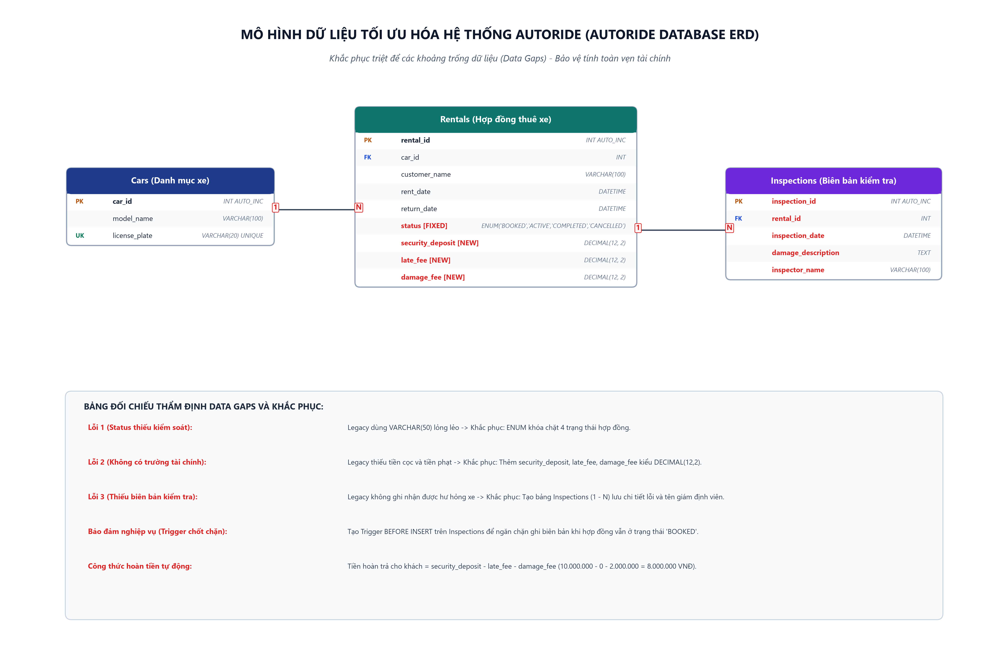

# [Bài tập] Sự Cố Bốc Hơi Lợi Nhuận Tại AutoRide - Khi Dữ Liệu "Lệch Pha" Với Quy Trình Thực Tế

> **Khóa học**: Cơ sở dữ liệu & Hệ quản trị CSDL MySQL  
> **Học viên thực hiện**: Nguyễn Tuấn Đạt  
> **Vai trò**: Data Architect  
> **Kho lưu trữ (Repository)**: `https://github.com/proyctk03-eng/git-final-practice`  
> **Thư mục bài tập**: `autoride-profit-leak-fix/`

---

## 1. Bối cảnh Dự án & Vấn đề Cốt lõi

Startup cho thuê xe tự lái **AutoRide** vừa triển khai hệ thống quản lý mới. Bộ phận Phân tích nghiệp vụ (BA) đã thiết kế Lưu đồ hoạt động (UML Activity Diagram) chặt chẽ cho quy trình "Thuê và Trả xe":
1. Khách đặt xe và đóng **Tiền cọc (Security Deposit)**. Trạng thái: `BOOKED`.
2. Khách nhận xe, trạng thái chuyển sang: `ACTIVE`.
3. Khi khách trả xe, nhân viên thực hiện **Kiểm tra tình trạng xe (Inspection)**.
4. **Nhánh rẽ nghiệp vụ lúc trả xe**:
   - Nếu trễ giờ: Tính **Phí phạt trễ (Late Fee)**.
   - Nếu trầy xước/hư hỏng: Ghi nhận chi tiết lỗi và tính **Phí sửa chữa (Damage Fee)**.
   - Quyết toán: `Tiền hoàn lại = Tiền cọc - Phí phạt trễ - Phí sửa chữa`. Trạng thái chuyển sang: `COMPLETED`.

Tuy nhiên, sau một tháng vận hành, kế toán phát hiện công ty **lỗ nặng** do Lập trình viên thiết kế Database quá sơ sài. Hệ thống không có chỗ nhập tiền phạt hay chi phí sửa chữa, khiến nhân viên buộc phải trả lại toàn bộ tiền cọc cho khách dù xe bị vỡ hỏng, dẫn đến "bốc hơi" toàn bộ lợi nhuận.

---

## 2. Bảng Chẩn đoán 4 Khoảng Trống Dữ Liệu (Data Gaps Analysis)

| STT | Điểm chạm nghiệp vụ (UML Activity Diagram) | Hiện trạng trong Legacy Database | Hậu quả thực tế tại AutoRide | Giải pháp khắc phục trong Schema mới |
|:---:|---|---|---|---|
| 1 | Khách đặt xe phải đóng Tiền cọc (`security_deposit`) để kích hoạt hợp đồng | Bảng `Rentals` hoàn toàn không có cột lưu số tiền cọc đã thu | Thu ngân không có căn cứ đối soát trên hệ thống, dễ thất thoát tiền mặt hoặc trả nhầm số tiền | Bổ sung cột `security_deposit DECIMAL(12, 2) NOT NULL DEFAULT 0.00` |
| 2 | Nhánh rẽ trả xe: Tính Phí phạt trễ (`late_fee`) và Phí sửa chữa hư hại (`damage_fee`) | Không có trường dữ liệu lưu trữ các khoản phí phạt phát sinh lúc trả xe | Kế toán không thể tính được `Tiền hoàn lại = Cọc - Phạt`, nhân viên đành hoàn trả 100% cọc khiến công ty gánh chịu toàn bộ chi phí sửa xe | Thêm `late_fee DECIMAL(12, 2) DEFAULT 0.00` và `damage_fee DECIMAL(12, 2) DEFAULT 0.00` |
| 3 | Nghiệp vụ kiểm tra tình trạng xe lúc nhận và trả xe (Vehicle Inspection) | Thiếu hoàn toàn bảng ghi nhận biên bản kiểm tra xe và chi tiết hư hỏng | Nhân viên phải ghi sổ tay; khi xảy ra tranh chấp khách hàng khiếu nại vì hệ thống không có bằng chứng lưu vết ai kiểm tra, ngày nào, hư hỏng gì | Tạo bảng mới `Inspections` (`inspection_id`, `rental_id`, `inspection_date`, `damage_description`, `inspector_name`) |
| 4 | Quản lý chuyển đổi trạng thái hợp đồng (BOOKED -> ACTIVE -> COMPLETED / CANCELLED) | Cột `status VARCHAR(50) DEFAULT 'BOOKED'` không có ràng buộc | Nhân viên có thể gõ sai chính tả hoặc cập nhật trạng thái tùy tiện làm gãy luồng xử lý tự động của ứng dụng | Khóa chặt bằng `ENUM('BOOKED', 'ACTIVE', 'COMPLETED', 'CANCELLED')` |

---

## 3. Sơ đồ Thực thể Liên kết Tối ưu (ERD)



---

## 4. Cấu trúc Bảng Dữ liệu Sau Tối ưu

### 4.1. Bảng `Cars` (Danh mục xe)
- `car_id INT AUTO_INCREMENT PRIMARY KEY`: Mã định danh xe.
- `model_name VARCHAR(100) NOT NULL`: Tên dòng xe (ví dụ: VinFast VF8 Plus).
- `license_plate VARCHAR(20) UNIQUE NOT NULL`: Biển số xe duy nhất.

### 4.2. Bảng `Rentals` (Hợp đồng thuê xe)
- `rental_id INT AUTO_INCREMENT PRIMARY KEY`: Mã hợp đồng thuê.
- `car_id INT NOT NULL`: Khóa ngoại tham chiếu đến `Cars(car_id)`.
- `customer_name VARCHAR(100) NOT NULL`: Họ tên khách thuê.
- `rent_date DATETIME NOT NULL`: Ngày giờ nhận xe.
- `return_date DATETIME`: Ngày giờ trả xe thực tế.
- `status ENUM('BOOKED', 'ACTIVE', 'COMPLETED', 'CANCELLED') NOT NULL DEFAULT 'BOOKED'`: Vòng đời hợp đồng được chuẩn hóa và kiểm soát chặt chẽ.
- `security_deposit DECIMAL(12, 2) NOT NULL DEFAULT 0.00`: Số tiền cọc đã thu.
- `late_fee DECIMAL(12, 2) NOT NULL DEFAULT 0.00`: Tiền phạt quá giờ.
- `damage_fee DECIMAL(12, 2) NOT NULL DEFAULT 0.00`: Tiền phạt hư hỏng xe.

### 4.3. Bảng `Inspections` (Biên bản kiểm tra tình trạng xe)
- `inspection_id INT AUTO_INCREMENT PRIMARY KEY`: Mã biên bản giám định.
- `rental_id INT NOT NULL`: Khóa ngoại liên kết `Rentals(rental_id)` với `ON DELETE RESTRICT`.
- `inspection_date DATETIME NOT NULL DEFAULT CURRENT_TIMESTAMP`: Thời điểm kiểm định.
- `damage_description TEXT`: Mô tả chi tiết vết xước, va chạm, linh kiện vỡ.
- `inspector_name VARCHAR(100) NOT NULL`: Họ tên nhân viên thực hiện kiểm tra.

---

## 5. Kịch bản Vận hành & Kết quả Quyết toán Thực tế

Khi khách hàng **Nguyen Van A** thuê xe VinFast VF8 cọc 10.000.000 VNĐ, khi trả xe bị vỡ đèn pha trái với chi phí khắc phục 2.000.000 VNĐ:

```sql
SELECT 
    r.rental_id AS 'Ma_Hop_Dong',
    r.customer_name AS 'Khach_Hang',
    c.model_name AS 'Mau_Xe',
    c.license_plate AS 'Bien_So',
    r.status AS 'Trang_Thai',
    i.damage_description AS 'Bien_Ban_Hu_Hong',
    FORMAT(r.security_deposit, 0) AS 'Tien_Coc_VND',
    FORMAT(r.late_fee, 0) AS 'Phat_Tre_VND',
    FORMAT(r.damage_fee, 0) AS 'Phat_Hu_Hai_VND',
    FORMAT(r.security_deposit - r.late_fee - r.damage_fee, 0) AS 'Tien_Hoan_Tra_Khach_VND'
FROM Rentals r
JOIN Cars c ON r.car_id = c.car_id
LEFT JOIN Inspections i ON r.rental_id = i.rental_id
WHERE r.customer_name = 'Nguyen Van A';
```

### Bảng Kết quả Truy vấn Quyết toán:
| Ma_Hop_Dong | Khach_Hang | Mau_Xe | Bien_So | Trang_Thai | Bien_Ban_Hu_Hong | Tien_Coc_VND | Phat_Tre_VND | Phat_Hu_Hai_VND | Tien_Hoan_Tra_Khach_VND |
|:---:|---|---|---|:---:|---|:---:|:---:|:---:|:---:|
| 1 | Nguyen Van A | VinFast VF8 Plus | 30K-888.88 | COMPLETED | Vỡ đèn pha trái phía trước do va chạm, trầy xước cản trước | 10,000,000 | 0 | 2,000,000 | **8,000,000** |

Hệ thống đã tự động khấu trừ chính xác 2.000.000 VNĐ tiền đèn pha, số tiền hoàn trả cho khách là 8.000.000 VNĐ, triệt tiêu hoàn toàn sự cố bốc hơi lợi nhuận.

---

## 6. Bảo Vệ Thiết Kế - Giải Đáp 3 Câu Hỏi Vấn Đáp Chuyên Sâu

### Câu hỏi 1: Tại sao việc tách dữ liệu kiểm tra xe ra một bảng riêng (`Inspections`) lại tốt hơn việc nhồi nhét một cột `damage_description` trực tiếp vào bảng `Rentals`?
**Trả lời**:
1. **Tuân thủ chuẩn hóa dữ liệu (1NF & 2NF)**: Nhồi nhét cột `damage_description` vào `Rentals` sẽ biến nó thành cột có tỷ lệ NULL rất cao (khi xe trả nguyên vẹn), gây lãng phí tài nguyên lưu trữ và vi phạm tính nguyên tử của thuộc tính.
2. **Quy trình thực tế gồm nhiều mốc kiểm tra (Quan hệ 1 - N)**: Một chu trình thuê xe có ít nhất hai thời điểm kiểm tra:
   - *Biên bản bàn giao (Check-out)*: Ghi nhận tình trạng xe trước khi khách lái đi.
   - *Biên bản thu hồi (Check-in)*: Ghi nhận tình trạng xe khi khách bàn giao lại.
   Nếu chỉ có một cột duy nhất trong `Rentals`, dữ liệu lần kiểm tra sau sẽ ghi đè lên dữ liệu lần trước, làm mất bằng chứng pháp lý chứng minh vết hư hỏng xuất hiện trong thời gian khách thuê hay đã có từ trước.
3. **Mở rộng trong tương lai**: Tách bảng riêng cho phép lưu nhiều ảnh chụp hiện trường (image attachments), nhiều hạng mục giám định độc lập (thân vỏ, động cơ, nội thất) và danh tính các kỹ thuật viên kiểm định khác nhau.

---

### Câu hỏi 2: Nếu muốn quy định: Khi hợp đồng đang ở trạng thái `BOOKED` (khách chưa nhận xe) thì không ai được phép insert dữ liệu vào bảng `Inspections` cho hợp đồng đó. Dùng cơ chế nào của Database để chặn điều này?
**Trả lời**:
Ta sử dụng **Trigger `BEFORE INSERT` trên bảng `Inspections`** (kết hợp với lệnh `SIGNAL SQLSTATE '45000'`):
```sql
DELIMITER //
CREATE TRIGGER before_insert_inspections
BEFORE INSERT ON Inspections
FOR EACH ROW
BEGIN
    DECLARE current_status ENUM('BOOKED', 'ACTIVE', 'COMPLETED', 'CANCELLED');
    
    SELECT status INTO current_status 
    FROM Rentals 
    WHERE rental_id = NEW.rental_id;
    
    IF current_status = 'BOOKED' THEN
        SIGNAL SQLSTATE '45000'
        SET MESSAGE_TEXT = 'Loi nghiep vu: Khong the tao bien ban kiem tra xe khi hop dong dang o trang thai BOOKED. Khach hang chua nhan xe.';
    END IF;
END //
DELIMITER ;
```
**Giải thích chuyên môn**: Ràng buộc `CHECK` trong chuẩn MySQL không hỗ trợ truy vấn chéo bảng (subquery / cross-table check). Do đó, Trigger là cơ chế phía máy chủ (Server-side constraint) duy nhất, tin cậy nhất đảm bảo toàn vẹn dữ liệu ngay cả khi ứng dụng bị lỗi logic hay ai đó cố tình can thiệp trực tiếp vào Database.

---

### Câu hỏi 3: Sự thiếu đồng bộ giữa Activity Diagram do BA vẽ và ERD do Dev thiết kế thường dẫn đến những hậu quả gì về mặt trải nghiệm người dùng cuối trên ứng dụng?
**Trả lời**:
1. **Ứng dụng hiển thị mập mờ, mất lòng tin (Trust Erosion)**: Giao diện người dùng (UI) không thể hiển thị chi tiết hóa đơn khấu trừ từng mục (khách chỉ thấy bị trừ tiền mà không xem được lý do vì sao bị trừ 2 triệu, trừ vì lỗi gì, ai kiểm tra).
2. **Gãy luồng trải nghiệm số (Broken User Journey)**: Do Database thiếu trường, nhân viên tại điểm trả xe phải quay về quy trình thủ công: lấy giấy bút ghi sổ, gọi điện về kế toán xin số tài khoản để khách chuyển khoản đền bù, hoặc giữ chân khách hàng tại bãi xe hàng giờ để chờ duyệt biên bản viết tay.
3. **Tranh chấp và khiếu nại bùng nổ**: Khách hàng không nhận được email/thông báo xác nhận tình trạng xe theo thời gian thực (real-time notification), dẫn đến khiếu nại ngân hàng (chargeback) hoặc đánh giá 1 sao trên kho ứng dụng, phá hủy thương hiệu của startup.

---

## 7. Danh mục File Dự Án Hoàn Thành
- `autoride_db.sql`: Kịch bản SQL DDL, Trigger kiểm soát và DML mô phỏng thực tế.
- `er_activity_mapping.md`: Báo cáo phân tích dưới 200 từ giải thích tính bắt buộc của cột `damage_fee`.
- `ai_prompt_log.md`: Nhật ký tương tác kỹ thuật chuyên sâu với AI.
- `erd_autoride.png`: Sơ đồ ERD tối ưu hóa độ phân giải 300 DPI.
- `index.html`: Ứng dụng web trực quan demo quy trình kiểm định và công cụ tính toán quyết toán cọc.
- `generate_erd.py`: Script Python vẽ sơ đồ ERD.
