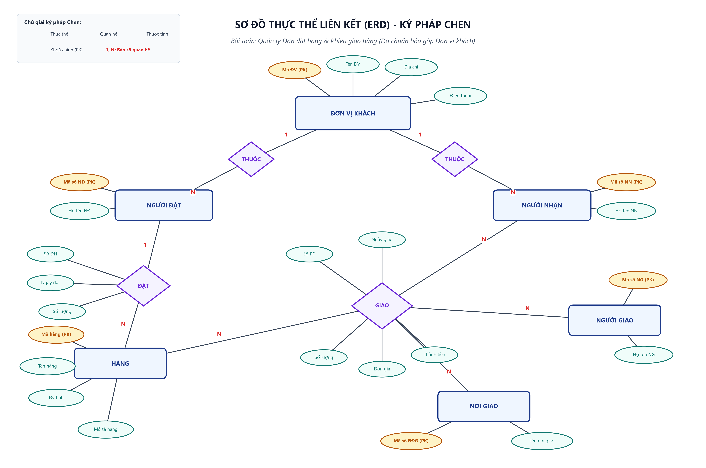
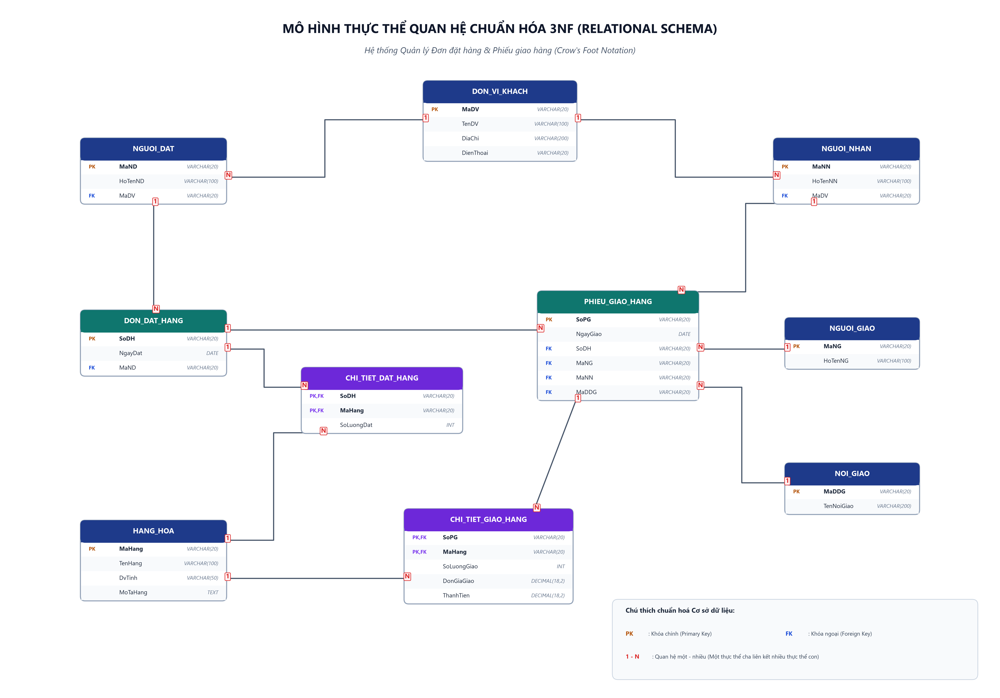
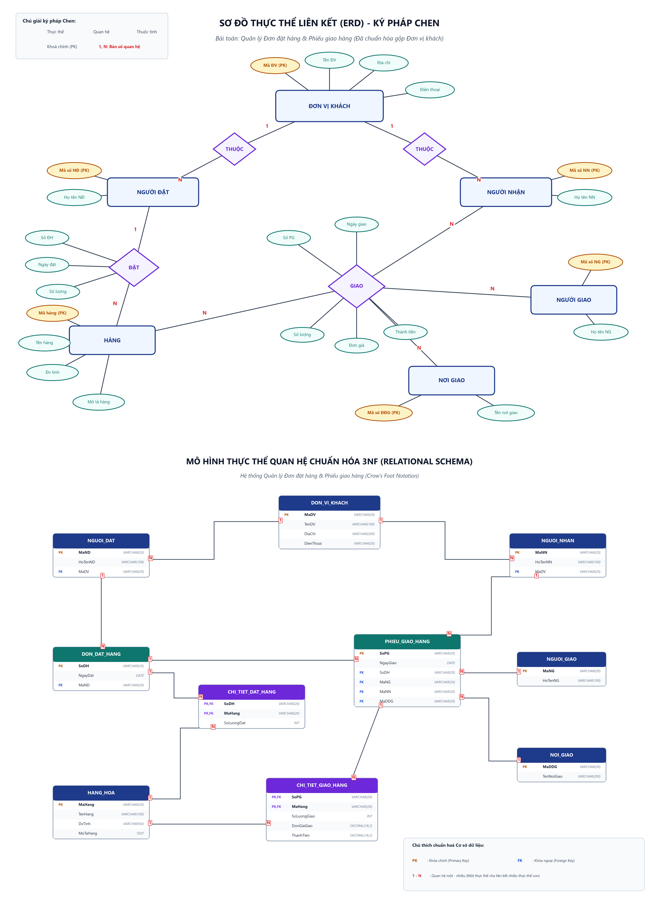

# [Thực hành] Quản lý đơn đặt hàng

> **Khoá học**: Cơ sở dữ liệu & Hệ quản trị CSDL  
> **Sinh viên thực hiện**: Nguyễn Tuấn Đạt  
> **Thư mục bài tập**: `erd-order-management/`

---

## 1. Mục tiêu bài thực hành
- Xây dựng mô hình thực thể liên kết (ERD) cho bài toán Quản lý đơn đặt hàng và Phiếu giao hàng.
- Nắm vững quy trình 5 bước thiết kế CSDL: chọn lọc thông tin, xác định thực thể - thuộc tính, xác định mối quan hệ, vẽ biểu đồ ERD và chuẩn hóa mô hình.
- Chuyển đổi mô hình ERD ký pháp Chen sang mô hình thực thể quan hệ chuẩn hóa bậc 3 (3NF) với ký pháp Crow's Foot.

---

## 2. Hình ảnh Sơ đồ ERD

### 2.1. Sơ đồ ERD Ký pháp Chen (Đã chuẩn hóa gộp Đơn vị khách)

### 2.2. Mô hình Thực thể Quan hệ Chuẩn hóa 3NF (Crow's Foot Notation)

### 2.3. Sơ đồ tổng hợp đầy đủ

---

## 3. Nội dung 5 bước thực hiện chi tiết

### Bước 1: Liệt kê, chọn lọc thông tin
- **Đơn đặt hàng**:
  - Số đơn hàng (Số ĐH) - Thuộc tính nhận diện
  - Tên đơn vị đặt hàng (Tên ĐV), Địa chỉ, Điện thoại
  - Ngày đặt
  - Tên hàng, Mô tả, Đơn vị tính (Đv tính), Số lượng
  - Người đặt hàng (Họ tên NĐ)
- **Phiếu giao hàng**:
  - Số phiếu giao hàng (Số PG) - Thuộc tính nhận diện
  - Tên đơn vị đặt hàng, Địa chỉ
  - Nơi giao hàng (Tên nơi GH)
  - Ngày giao
  - Tên hàng, Đơn vị tính (Đv tính), Số lượng, Đơn giá, Thành tiền
  - Tên người nhận (Họ tên NN), Tên người giao (Họ tên NG)

### Bước 2: Xác định thực thể và thuộc tính
| Tên thực thể | Thuộc tính khóa (PK) | Các thuộc tính mô tả |
|---|---|---|
| **ĐƠN VỊ ĐH** | Mã ĐV | Tên ĐV, Địa chỉ, Điện thoại |
| **ĐƠN VỊ KH** | Mã ĐV | Tên ĐV, Địa chỉ |
| **HÀNG** | Mã hàng | Tên hàng, Đv tính, Mô tả hàng |
| **NGƯỜI ĐẶT** | Mã số NĐ | Họ tên NĐ |
| **NƠI GIAO** | Mã số ĐĐG | Tên nơi giao |
| **NGƯỜI NHẬN** | Mã số NN | Họ tên NN |
| **NGƯỜI GIAO** | Mã số NG | Họ tên NG |

### Bước 3: Xác định các mối quan hệ
- **Người đặt hàng THUỘC Đơn vị đặt hàng** (Quan hệ 1 - N).
- **Người nhận hàng THUỘC Đơn vị khách hàng** (Quan hệ 1 - N).
- **Quan hệ ĐẶT**: Người đặt hàng đặt các mặt Hàng (chứa các thuộc tính: Số ĐH, Ngày đặt, Số lượng).
- **Quan hệ GIAO**: Người giao thực hiện giao Hàng cho Người nhận tại Nơi giao (chứa các thuộc tính: Số PG, Ngày giao, Số lượng, Đơn giá, Thành tiền).

### Bước 4: Vẽ biểu đồ mô hình thực thể ERD
- Thực thể: Hình chữ nhật.
- Thuộc tính: Hình elip.
- Mối quan hệ: Hình thoi.

### Bước 5: Chuẩn hóa, rút gọn mô hình thực thể ERD
- Hợp nhất **Đơn vị đặt hàng** và **Đơn vị khách hàng** thành một thực thể duy nhất là **ĐƠN VỊ KHÁCH** gồm: `Mã ĐV` (PK), `Tên ĐV`, `Địa chỉ`, `Điện thoại`.
- Cả **NGƯỜI ĐẶT** và **NGƯỜI NHẬN** đều trực thuộc **ĐƠN VỊ KHÁCH** thông qua khóa ngoại `MaDV`.

---

## 4. Danh mục File mã nguồn & Tài liệu
- `erd_diagram.png`: Ảnh tổng hợp sơ đồ ERD phục vụ nộp bài.
- `erd_chen_model.png`: Ảnh sơ đồ ERD ký pháp Chen độ phân giải cao 300 DPI.
- `erd_relational_3nf.png`: Ảnh mô hình quan hệ chuẩn hóa 3NF độ phân giải cao 300 DPI.
- `schema.sql`: Kịch bản SQL DDL khởi tạo cơ sở dữ liệu.
- `index.html`: Giao diện web trực quan hiển thị sơ đồ và nội dung bài thực hành.
- `generate_chen_erd.py`: Script Python sinh sơ đồ Chen.
- `generate_relational_erd.py`: Script Python sinh mô hình quan hệ 3NF.
- `combine_images.py`: Script Python ghép ảnh tổng hợp.
