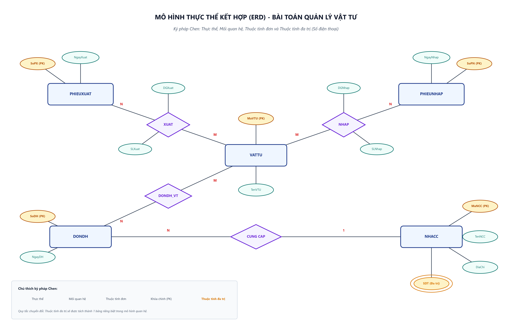
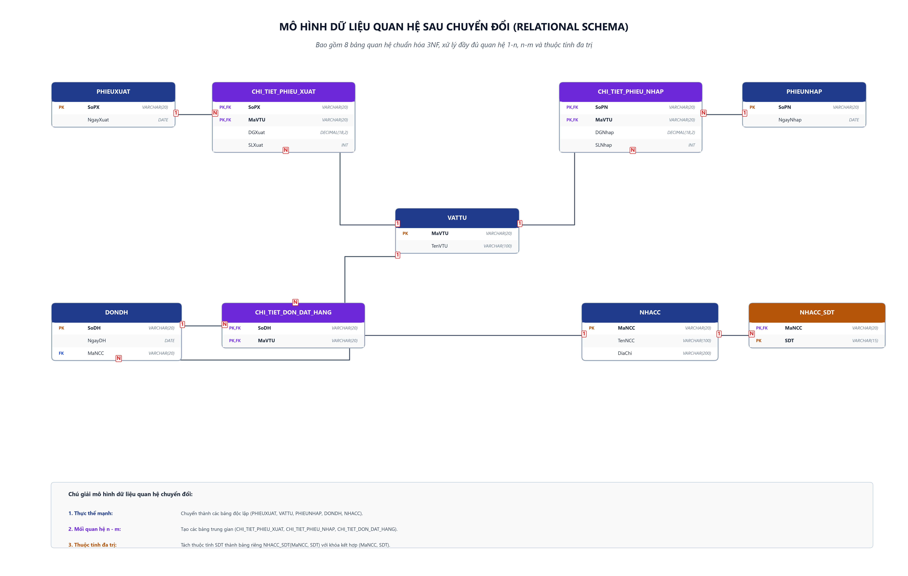

# [Bài tập] Chuyển đổi ERD sang mô hình quan hệ

> **Khoá học**: Cơ sở dữ liệu & Hệ quản trị CSDL  
> **Sinh viên thực hiện**: Nguyễn Tuấn Đạt  
> **Kho lưu trữ (Repository)**: `https://github.com/proyctk03-eng/git-final-practice`  
> **Thư mục bài tập**: `erd-to-relational/`

---

## 1. Mục tiêu bài tập
- Nắm vững và thực hành quy trình 4 bước chuyển đổi từ mô hình thực thể kết hợp (ERD) sang mô hình dữ liệu quan hệ (Relational Model).
- Xử lý chính xác các mối quan hệ 1 - 1, 1 - n và n - m.
- Xử lý thuộc tính đa trị (Multivalued Attribute) để chuẩn hóa về dạng chuẩn 1 (1NF).
- Xác định đầy đủ khóa chính (PK), khóa chính kết hợp và khóa ngoại (FK) liên kết giữa các bảng.

---

## 2. Hình ảnh Sơ đồ ERD & Mô hình Quan hệ

### 2.1. Sơ đồ ERD Ký pháp Chen đầu vào

### 2.2. Lược đồ Cơ sở Dữ liệu Quan hệ sau chuyển đổi (3NF)

### 2.3. Ảnh tổng hợp nộp bài

---

## 3. Nội dung thực hiện theo 4 bước hướng dẫn

### Bước 1: Xác định các thực thể có trong mô hình ERD
Mô hình ERD gồm 5 thực thể chính:
1. **PHIEUXUAT**: Quản lý phiếu xuất kho (`SoPX` [PK], `NgayXuat`).
2. **VATTU**: Quản lý danh mục vật tư (`MaVTU` [PK], `TenVTU`).
3. **PHIEUNHAP**: Quản lý phiếu nhập kho (`SoPN` [PK], `NgayNhap`).
4. **DONDH**: Quản lý đơn đặt hàng (`SoDH` [PK], `NgayDH`).
5. **NHACC**: Quản lý đối tác nhà cung cấp (`MaNCC` [PK], `TenNCC`, `DiaChi`, `SDT` [đa trị]).

---

### Bước 2: Xác định các mối quan hệ (1 - 1, 1 - n, n - m)

1. **Mối quan hệ 1 - n (`CUNG_CAP` giữa NHACC và DONDH)**:
   - Một nhà cung cấp có thể cung cấp cho nhiều đơn đặt hàng (1 - n).
   - Đưa khóa chính `MaNCC` của thực thể phía 1 (`NHACC`) sang thực thể phía nhiều (`DONDH`) làm khóa ngoại `FK`.
   - Bảng kết quả: `DONDH(SoDH [PK], NgayDH, MaNCC [FK])`.

2. **Mối quan hệ n - m (`XUAT` giữa PHIEUXUAT và VATTU)**:
   - Một phiếu xuất có thể xuất nhiều vật tư và một vật tư có thể xuất trong nhiều phiếu xuất (n - m).
   - Mối quan hệ có các thuộc tính kết hợp: `DGXuat`, `SLXuat`.
   - Sinh ra bảng trung gian: `CHI_TIET_PHIEU_XUAT(SoPX [PK, FK], MaVTU [PK, FK], DGXuat, SLXuat)`.

3. **Mối quan hệ n - m (`NHAP` giữa PHIEUNHAP và VATTU)**:
   - Một phiếu nhập có thể nhập nhiều vật tư và một vật tư có thể nhập ở nhiều phiếu nhập (n - m).
   - Mối quan hệ có các thuộc tính kết hợp: `DGNhap`, `SLNhap`.
   - Sinh ra bảng trung gian: `CHI_TIET_PHIEU_NHAP(SoPN [PK, FK], MaVTU [PK, FK], DGNhap, SLNhap)`.

4. **Mối quan hệ n - m (`DAT_HANG` giữa DONDH và VATTU)**:
   - Một đơn hàng đặt nhiều vật tư và một vật tư nằm trong nhiều đơn hàng (n - m).
   - Sinh ra bảng trung gian: `CHI_TIET_DON_DAT_HANG(SoDH [PK, FK], MaVTU [PK, FK])`.

---

### Bước 3: Xác định các thuộc tính đa trị và tạo thành 1 bảng mới
- Trong thực thể `NHACC`, thuộc tính `SDT` (Số điện thoại) là thuộc tính đa trị (biểu diễn bằng 2 vòng elip lồng nhau).
- Để triệt tiêu thuộc tính đa trị và chuẩn hóa bảng về dạng chuẩn 1 (1NF), ta tách thuộc tính `SDT` thành bảng riêng:
  - Tên bảng: `NHACC_SDT` (hoặc `SO_DIEN_THOAI_NCC`).
  - Các trường: `MaNCC` (FK tham chiếu đến `NHACC.MaNCC`), `SDT`.
  - Khóa chính kết hợp: `(MaNCC, SDT)`.

---

### Bước 4: Liệt kê lại danh sách các bảng sau khi chuyển đổi xong

| STT | Tên bảng | Khóa chính (PK) | Khóa ngoại (FK) | Các thuộc tính khác |
|:---:|---|---|---|---|
| 1 | `PHIEUXUAT` | `SoPX` | Không có | `NgayXuat` |
| 2 | `VATTU` | `MaVTU` | Không có | `TenVTU` |
| 3 | `CHI_TIET_PHIEU_XUAT` | `(SoPX, MaVTU)` | `SoPX -> PHIEUXUAT`, `MaVTU -> VATTU` | `DGXuat`, `SLXuat` |
| 4 | `PHIEUNHAP` | `SoPN` | Không có | `NgayNhap` |
| 5 | `CHI_TIET_PHIEU_NHAP` | `(SoPN, MaVTU)` | `SoPN -> PHIEUNHAP`, `MaVTU -> VATTU` | `DGNhap`, `SLNhap` |
| 6 | `DONDH` | `SoDH` | `MaNCC -> NHACC` | `NgayDH` |
| 7 | `CHI_TIET_DON_DAT_HANG` | `(SoDH, MaVTU)` | `SoDH -> DONDH`, `MaVTU -> VATTU` | Không có |
| 8 | `NHACC` | `MaNCC` | Không có | `TenNCC`, `DiaChi` |
| 9 | `NHACC_SDT` | `(MaNCC, SDT)` | `MaNCC -> NHACC` | `SDT` |

---

## 4. Danh mục File mã nguồn & Tài liệu
- `erd_input_model.png`: Ảnh sơ đồ ERD đầu vào theo ký pháp Chen (300 DPI).
- `erd_relational_schema.png`: Ảnh lược đồ quan hệ 8 bảng sau chuyển đổi (300 DPI).
- `erd_conversion_overview.png`: Ảnh ghép tổng hợp phục vụ nộp bài trực quan.
- `create_tables.sql`: Script SQL DDL tạo 8 bảng dữ liệu chuẩn hóa, kèm dữ liệu mẫu.
- `index.html`: Giao diện web trực quan hiển thị quy trình 4 bước và cấu trúc bảng.
- `generate_diagrams.py`: Script Python vẽ sơ đồ ERD và lược đồ quan hệ.
