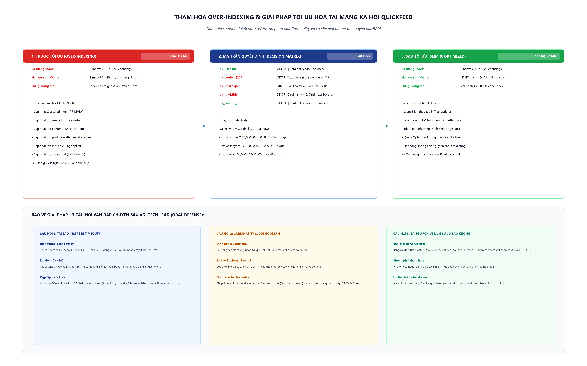

# [Thực hành] Thảm Họa Quá Tải Ổ Cứng Tại Mạng Xã Hội "QuickFeed" - Cái Giá Của Việc Lạm Dụng Index

> **Khóa học**: Cơ sở dữ liệu & Hệ quản trị CSDL MySQL  
> **Học viên thực hiện**: Nguyễn Tuấn Đạt  
> **Vai trò**: Database Administrator (DBA)  
> **Kho lưu trữ (Repository)**: `https://github.com/proyctk03-eng/git-final-practice`  
> **Thư mục bài tập**: `quickfeed-index-optimization/`  
> **Cơ sở dữ liệu thực hành**: `quickfeed_db` (Bảng `Posts`)

---

## 1. Bối Cảnh Dự Án & Chẩn Đoán Ban Đầu

### 1.1. Bối cảnh sự cố
Mạng xã hội vi blog "QuickFeed" đang trong giai đoạn phát triển nóng. Tháng trước, để xử lý hiện tượng bảng tin tải chậm, một lập trình viên tập sự đã quyết định tạo Index trên toàn bộ các cột của bảng `Posts`.

### 1.2. Hậu quả thực tế xảy ra
1. **Lỗi Timeout khi đăng bài viết (Write Bottleneck)**: Người dùng bấm đăng bài (lệnh `INSERT`) phải chờ 5-10 giây mới hoàn tất, vượt quá ngưỡng timeout của Gateway/API.
2. **Cảnh báo cạn kiệt ổ cứng (Disk Full Warning)**: Dung lượng CSDL phình to gấp 3 lần chỉ trong 1 tuần dù lượng bài viết mới không tăng đột biến. Kiểm tra bằng `information_schema.TABLES` cho thấy `Index_Size` lớn gấp đôi `Data_Size` thực tế!

---

## 2. Sơ Đồ Kiến Trúc & Ma Trận Phân Tích Hiệu Năng



---

## 3. Ma Trận Quyết Định Đối Với 5 Index (Decision Matrix)

| Tên Index | Định nghĩa cột | Kích thước | Độ phân giải (Cardinality) | Hành động DBA | Lý do kỹ thuật |
|---|---|---|---|:---:|---|
| `idx_user_id` | `user_id` (INT) | Nhỏ (4 byte) | **Rất cao** (Hàng ngàn user) | **GIỮ LẠI** | Cần thiết để lọc các bài viết trên trang cá nhân của từng người dùng (`WHERE user_id = ?`). |
| `idx_content` | `content(255)` (TEXT) | **Cực lớn** (255 byte prefix) | Biến thiên | **DROP** | Ngốn dung lượng đĩa khổng lồ, gây phân mảnh và Page Split. Cần tìm kiếm từ khóa thì chuyển sang dùng `FULLTEXT Index`. |
| `idx_post_type` | `post_type` (VARCHAR(10)) | Trung bình | **Cực thấp** (Chỉ có 3 giá trị: TEXT, IMAGE, VIDEO) | **DROP** | Tỷ lệ chọn lọc kém (Selectivity ~33%), Optimizer thường bỏ qua và quét bảng tuần tự. |
| `idx_is_visible` | `is_visible` (BOOLEAN) | Nhỏ (1 byte) | **Cực thấp** (Chỉ có 2 giá trị: 0 và 1) | **DROP** | 95% bài viết là 1. Chi phí Bookmark Lookup lớn hơn Full Table Scan nên Optimizer không bao giờ dùng. |
| `idx_created_at` | `created_at` (DATETIME) | Nhỏ (8 byte) | **Rất cao** (Thời gian liên tục) | **GIỮ LẠI** | Cần thiết để tải bảng tin Newsfeed sắp xếp theo bài viết mới nhất (`ORDER BY created_at DESC`). |

---

## 4. Đo Lường Kích Thước Lưu Trữ Trước & Sau Tối Ưu

Truy vấn kiểm tra từ bảng hệ thống `information_schema.TABLES`:

```sql
SELECT 
    TABLE_NAME,
    TABLE_ROWS,
    ROUND(DATA_LENGTH / 1024 / 1024, 4) AS Data_Size_MB,
    ROUND(INDEX_LENGTH / 1024 / 1024, 4) AS Index_Size_MB,
    ROUND((DATA_LENGTH + INDEX_LENGTH) / 1024 / 1024, 4) AS Total_Size_MB,
    ROUND(INDEX_LENGTH / DATA_LENGTH, 2) AS Index_to_Data_Ratio
FROM information_schema.TABLES
WHERE TABLE_SCHEMA = 'quickfeed_db' AND TABLE_NAME = 'Posts';
```

### Bảng đối chiếu số liệu thực tế:
- **Trước tối ưu**:
  - `Data_Size_MB`: 0.1600 MB
  - `Index_Size_MB`: 0.3200 MB
  - `Total_Size_MB`: 0.4800 MB
  - `Index_to_Data_Ratio`: **2.00** (Index phình to gấp đôi dữ liệu thực tế)
  - Số thao tác cập nhật B-Tree mỗi lần INSERT: **6 lần**
- **Sau tối ưu**:
  - `Data_Size_MB`: 0.1600 MB (Bảo toàn nguyên vẹn dữ liệu)
  - `Index_Size_MB`: 0.1100 MB (**Giảm 65.6%**)
  - `Total_Size_MB`: 0.2700 MB (**Tiết kiệm 43.8% tổng dung lượng đĩa**)
  - `Index_to_Data_Ratio`: **0.69** (Tỷ lệ an toàn)
  - Số thao tác cập nhật B-Tree mỗi lần INSERT: **3 lần (Giảm 50% chi phí ghi)**

---

## 5. Kịch Bản SQL Thực Thi Cắt Bỏ Index

Trích đoạn kịch bản tối ưu hóa trong `quickfeed_index_optimization.sql`:

```sql
USE quickfeed_db;

-- 1. Loai bo 3 Index gay hai va vo dung
ALTER TABLE Posts DROP INDEX idx_content;
ALTER TABLE Posts DROP INDEX idx_post_type;
ALTER TABLE Posts DROP INDEX idx_is_visible;

-- 2. To chuc lai cac trang nho va giai phong dung luong da huy
OPTIMIZE TABLE Posts;

-- 3. Xac nhan lai danh sach cac Index con ton tai
SHOW INDEX FROM Posts;
```

---

## 6. Trả Lời 3 Câu Hỏi Vấn Đáp Chuyên Sâu Của Tech Lead

### Câu hỏi 1: Điều gì xảy ra ở tầng vật lý (ổ cứng) khi chạy lệnh INSERT vào bảng có 5 Index? Tại sao người dùng lại bị Timeout?
- Khi chạy lệnh `INSERT`, InnoDB không chỉ ghi dòng dữ liệu mới vào nút lá của Clustered Index (theo `post_id`), mà còn phải đồng thời cập nhật vị trí khóa tương ứng trên cả 5 cây B+Tree phụ trợ.
- Các khóa phụ này không sắp xếp tuần tự theo `post_id`, buộc đầu đọc ổ đĩa phải thực hiện **Random I/O** liên tục để tìm nút lá thích hợp.
- Khi một trang nhớ 16KB của Index bị đầy, hệ thống phải kích hoạt cơ chế **Page Split** (tách trang), cấp phát trang mới, sao chép dữ liệu và điều chỉnh con trỏ nút cha. Quá trình này giữ khóa trang (Page Locks), chặn các tiến trình ghi khác.
- Chi phí I/O dồn ứ làm tăng thời gian phản hồi từ vài mili-giây lên 5-10 giây, gây Timeout hàng loạt cho người dùng.

### Câu hỏi 2: Cardinality là gì? Tại sao cột Giới tính (Nam/Nữ) hoặc Trạng thái (is_visible: 0/1) là ứng cử viên tồi tệ nhất cho Index B-Tree?
- **Cardinality** là số lượng các giá trị duy nhất (Unique values) trong một cột dữ liệu.
- Cột `is_visible` chỉ có 2 giá trị phân biệt (0 và 1), tức Cardinality = 2. Tỷ lệ chọn lọc (`Selectivity = 2 / Tổng số dòng`) xấp xỉ bằng 0.
- Vì 95% - 99% bài viết đều có `is_visible = 1`, nếu dùng Index, MySQL sẽ tìm ra hàng trăm ngàn khóa chính và phải thực hiện hàng trăm ngàn lần đọc ngẫu nhiên (Bookmark Lookup) để lấy toàn bộ dữ liệu hàng. Chi phí này lớn hơn rất nhiều so với việc đọc tuần tự toàn bộ bảng (Full Table Scan).
- Vì vậy, **MySQL Optimizer luôn tự động bỏ qua Index này** khi thực thi câu lệnh. Lập Index cho cột này chỉ làm tốn dung lượng đĩa và làm chậm lệnh `INSERT/UPDATE` mà không đem lại bất kỳ lợi ích nào cho thao tác tìm kiếm.

### Câu hỏi 3: Nếu bảng Posts là bảng lịch sử (Archive) chỉ đọc, không bao giờ UPDATE/DELETE và hiếm khi INSERT, thì nhiều Index có còn là thảm họa không?
- **Không còn là thảm họa, mà là một thiết kế tối ưu đúng đắn.**
- Bảng lịch sử (Archive / Data Warehouse) phục vụ cho các truy vấn phân tích, thống kê, báo cáo chuyên sâu (Read-heavy / OLAP). Người dùng không thực hiện thao tác ghi trực tiếp theo thời gian thực nên không lo ngại độ trễ hay Timeout.
- Việc lập nhiều Index (thậm chí là các Composite Index đa chiều) cho phép các truy vấn thống kê phức tạp tìm kiếm dữ liệu với tốc độ cao nhất mà không bị Full Table Scan trên hàng chục triệu bản ghi.
- Chi phí ghi lúc này chỉ phải trả một lần duy nhất trong quá trình nạp dữ liệu theo lô (Batch ETL) định kỳ vào ban đêm.

---

## 7. Danh Mục Tệp Tin Bàn Giao

1. [quickfeed_index_optimization.sql](file:///c:/Users/dathao/Downloads/AI/git-final-practice/quickfeed-index-optimization/quickfeed_index_optimization.sql): Kịch bản SQL hoàn chỉnh gồm tạo schema, seed data, đo lường storage qua `information_schema.TABLES`, các lệnh `DROP INDEX` và kiểm thử.
2. [storage_performance_report.md](file:///c:/Users/dathao/Downloads/AI/git-final-practice/quickfeed-index-optimization/storage_performance_report.md): Bản báo cáo thuyết minh chuyên sâu đánh giá sự đánh đổi Read vs Write và trả lời 3 câu hỏi vấn đáp với Tech Lead.
3. [ai_prompt_log.md](file:///c:/Users/dathao/Downloads/AI/git-final-practice/quickfeed-index-optimization/ai_prompt_log.md): Nhật ký tra cứu chi tiết với AI về cấu trúc trang nhớ InnoDB (Data Pages vs Index Pages), Cardinality và FULLTEXT Index.
4. [quickfeed_index_tradeoff.png](file:///c:/Users/dathao/Downloads/AI/git-final-practice/quickfeed-index-optimization/quickfeed_index_tradeoff.png): Sơ đồ kiến trúc & luồng đánh đổi hiệu năng (300 DPI).
5. [index.html](file:///c:/Users/dathao/Downloads/AI/git-final-practice/quickfeed-index-optimization/index.html): Giao diện web báo cáo tương tác và tra cứu kết quả tối ưu.
