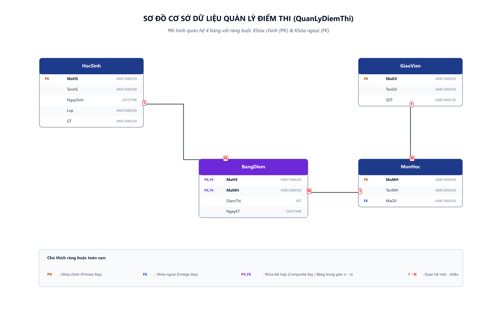

# [Thực hành] Tạo bảng trong CSDL (QuanLyDiemThi)

> **Khoá học**: Cơ sở dữ liệu & Hệ quản trị CSDL  
> **Sinh viên thực hiện**: Nguyễn Tuấn Đạt  
> **Kho lưu trữ (Repository)**: `https://github.com/proyctk03-eng/git-final-practice`  
> **Thư mục bài tập**: `sql-create-table-practice/`

---

## 1. Mục tiêu bài thực hành
- Sử dụng thành thạo các câu lệnh DDL (`CREATE DATABASE`, `USE`, `CREATE TABLE`, `ALTER TABLE ADD CONSTRAINT`).
- Nắm vững việc thiết lập khóa chính (`PRIMARY KEY`) đơn và khóa chính kết hợp (`COMPOSITE PRIMARY KEY`).
- Thiết lập các liên kết và ràng buộc toàn vẹn khóa ngoại (`FOREIGN KEY`) giữa các bảng.
- Biểu diễn và giải quyết mối quan hệ n - n giữa hai thực thể `HocSinh` và `MonHoc` thông qua bảng trung gian `BangDiem`.

---

## 2. Sơ đồ Quan hệ Cơ sở Dữ liệu (ERD)



---

## 3. Cấu trúc 4 Bảng trong CSDL

### 3.1. Bảng `HocSinh`
| STT | Tên trường | Kiểu dữ liệu | Độ dài | Ràng buộc |
|:---:|---|---|---|---|
| 1 | `MaHS` | VARCHAR | 20 | Primary Key |
| 2 | `TenHS` | VARCHAR | 50 | |
| 3 | `NgaySinh` | DATETIME | | |
| 4 | `Lop` | VARCHAR | 20 | |
| 5 | `GT` | VARCHAR | 20 | |

### 3.2. Bảng `MonHoc`
| STT | Tên trường | Kiểu dữ liệu | Độ dài | Ràng buộc |
|:---:|---|---|---|---|
| 1 | `MaMH` | VARCHAR | 50 | Primary Key |
| 2 | `TenMH` | VARCHAR | 50 | |
| 3 | `MaGV` | VARCHAR | 20 | Foreign Key (tham chiếu `GiaoVien.MaGV`) |

### 3.3. Bảng `BangDiem`
| STT | Tên trường | Kiểu dữ liệu | Độ dài | Ràng buộc |
|:---:|---|---|---|---|
| 1 | `MaHS` | VARCHAR | 20 | PK, FK (tham chiếu `HocSinh.MaHS`) |
| 2 | `MaMH` | VARCHAR | 50 | PK, FK (tham chiếu `MonHoc.MaMH`) |
| 3 | `DiemThi` | INT | | |
| 4 | `NgayKT` | DATETIME | | |

### 3.4. Bảng `GiaoVien`
| STT | Tên trường | Kiểu dữ liệu | Độ dài | Ràng buộc |
|:---:|---|---|---|---|
| 1 | `MaGV` | VARCHAR | 20 | Primary Key |
| 2 | `TenGV` | VARCHAR | 50 | |
| 3 | `SDT` | VARCHAR | 10 | |

---

## 4. Các bước thực hiện bằng câu lệnh SQL

### Bước 1: Tạo cơ sở dữ liệu `QuanLyDiemThi`
```sql
CREATE DATABASE QuanLyDiemThi;
```

### Bước 2: Chọn Database `QuanLyDiemThi` để thao tác
```sql
USE QuanLyDiemThi;
```

### Bước 3: Tạo bảng `HocSinh`
```sql
CREATE TABLE HocSinh (
    MaHS VARCHAR(20) PRIMARY KEY,
    TenHS VARCHAR(50),
    NgaySinh DATETIME,
    Lop VARCHAR(20),
    GT VARCHAR(20)
);
```

### Bước 4: Tạo bảng `MonHoc`
```sql
CREATE TABLE MonHoc (
    MaMH VARCHAR(50) PRIMARY KEY,
    TenMH VARCHAR(50),
    MaGV VARCHAR(20)
);
```

### Bước 5: Tạo bảng `BangDiem`
```sql
CREATE TABLE BangDiem (
    MaHS VARCHAR(20),
    MaMH VARCHAR(50),
    DiemThi INT,
    NgayKT DATETIME,
    PRIMARY KEY (MaHS, MaMH),
    FOREIGN KEY (MaHS) REFERENCES HocSinh(MaHS),
    FOREIGN KEY (MaMH) REFERENCES MonHoc(MaMH)
);
```

### Bước 6: Tạo bảng `GiaoVien`
```sql
CREATE TABLE GiaoVien (
    MaGV VARCHAR(20) PRIMARY KEY,
    TenGV VARCHAR(50),
    SDT VARCHAR(10)
);
```

### Bước 7: Bổ sung ràng buộc khóa ngoại cho bảng `MonHoc`
```sql
ALTER TABLE MonHoc 
ADD CONSTRAINT FK_MaGV FOREIGN KEY (MaGV) REFERENCES GiaoVien(MaGV);
```

---

## 5. Danh mục file mã nguồn
- `create_database.sql`: Toàn bộ kịch bản SQL thực thi, bao gồm tạo bảng, dữ liệu mẫu và truy vấn kiểm tra.
- `erd_quanly_diemthi.png`: Ảnh sơ đồ ERD trực quan (300 DPI).
- `index.html`: Giao diện web hiển thị bài làm và cấu trúc các bảng.
- `generate_erd_quanly_diemthi.py`: Mã nguồn Python sinh ảnh sơ đồ ERD.
