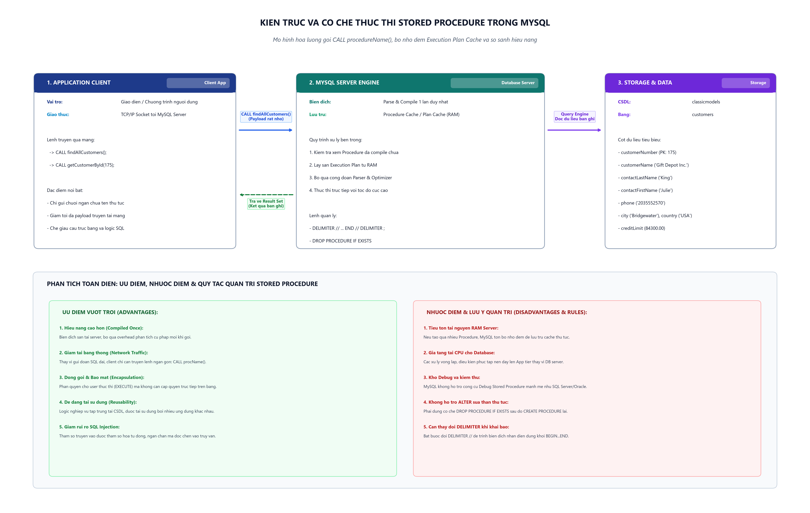

# [Thực hành] Stored Procedure Trong MySQL

> **Khóa học**: Cơ sở dữ liệu & Hệ quản trị CSDL MySQL  
> **Học viên thực hiện**: Nguyễn Tuấn Đạt  
> **Kho lưu trữ (Repository)**: `https://github.com/proyctk03-eng/git-final-practice`  
> **Thư mục bài tập**: `sql-stored-procedure/`  
> **Cơ sở dữ liệu thực hành**: `classicmodels` (Bảng `customers`)  
> **Nhánh tham khảo CodeGym**: `https://github.com/codegym-vn/jwbd-2023-using-stored-procedure` (nhánh `dev`)

---

## 1. Mục Tiêu Bài Thực Hành
- Nắm vững khái niệm, bản chất và vòng đời của **Stored Procedure** (Thủ tục lưu trữ) trong hệ quản trị cơ sở dữ liệu MySQL.
- Thành thạo việc tạo, biên dịch và triệu gọi Stored Procedure bằng các từ khóa:
  - `DELIMITER // ... DELIMITER ;`: Kỹ thuật thay đổi ký tự phân cách câu lệnh.
  - `CREATE PROCEDURE`: Khai báo tạo mới thủ tục.
  - `BEGIN ... END`: Khối lệnh thực thi nghiệp vụ bên trong thủ tục.
  - `CALL`: Lệnh triệu gọi thủ tục.
  - `DROP PROCEDURE IF EXISTS`: Lệnh xóa thủ tục để hỗ trợ quy trình cập nhật/tái tạo (Drop & Re-create).
- Hiểu rõ cơ chế quản lý và giới hạn của MySQL đối với Stored Procedure (tại sao MySQL không cho phép dùng `ALTER PROCEDURE` để sửa nội dung thân thủ tục).
- Mở rộng kiến thức về Stored Procedure có tham số đầu vào (`IN parameter`) phục vụ truy vấn động.

---

## 2. Kiến Trúc & Cơ Chế Hoạt Động Của Stored Procedure



### Cơ chế thực thi bên trong MySQL Server:
1. **Giai đoạn Biên dịch (Compilation)**: Khi chạy lệnh `CREATE PROCEDURE`, MySQL Server sẽ phân tích cú pháp (Parse), tối ưu hóa kế hoạch thực thi (Optimize) và lưu mã biên dịch vào bộ nhớ đệm **Procedure Cache / Execution Plan Cache**.
2. **Giai đoạn Triệu gọi (Execution)**: Khi ứng dụng gửi lệnh `CALL procedureName()`, MySQL Server bỏ qua bước phân tích cú pháp và trực tiếp nạp kế hoạch từ bộ nhớ đệm ra thực thi. Nhờ đó, thời gian đáp ứng nhanh hơn đáng kể so với việc gửi câu lệnh SQL thô (Raw SQL) chưa được biên dịch.

---

## 3. Phân Tích Ưu Điểm & Nhược Điểm Của Stored Procedure

### 3.1. Ưu Điểm (Advantages)
- **Tối ưu hóa hiệu năng thực thi**: Được biên dịch một lần và lưu trong bộ nhớ máy chủ, tiết kiệm chu kỳ CPU phục vụ cho việc parse và optimize câu lệnh lặp đi lặp lại.
- **Tiết kiệm băng thông mạng (Network Traffic)**: Thay vì ứng dụng phải gửi toàn bộ câu lệnh SQL dài qua kết nối mạng mạng, ứng dụng chỉ cần gửi chuỗi ngắn chứa tên thủ tục và tham số (ví dụ: `CALL findAllCustomers();`).
- **Tái sử dụng mã nguồn & Đóng gói nghiệp vụ**: Tập trung hóa các logic truy vấn phức tạp vào một nơi trên máy chủ CSDL, cho phép nhiều ứng dụng (Web, Mobile, Data Pipeline) cùng chia sẻ một logic nhất quán.
- **Tăng cường bảo mật (Security & Access Control)**: Quản trị viên CSDL (DBA) có thể cấp quyền thực thi (`GRANT EXECUTE`) cho người dùng trên từng Stored Procedure mà không cần cấp quyền truy cập trực tiếp (`GRANT SELECT, UPDATE`) trên các bảng dữ liệu gốc.
- **Chống tấn công SQL Injection**: Khi sử dụng tham số trong Stored Procedure, các giá trị truyền vào được xử lý độc lập dưới dạng tham số hóa (Parameterized Query), ngăn ngừa mã độc can thiệp vào câu lệnh.

### 3.2. Nhược Điểm & Giới Hạn Cần Lưu Ý (Disadvantages & Limitations)
- **Tốn bộ nhớ RAM máy chủ**: Việc duy trì quá nhiều Stored Procedure sẽ làm tăng lượng bộ nhớ mà MySQL cấp phát cho Procedure Cache.
- **Gia tăng tải CPU cho Database Server**: Nếu nhồi nhét quá nhiều logic xử lý dữ liệu phức tạp (vòng lặp, điều kiện rẽ nhánh) vào CSDL, CPU của DB Server sẽ quá tải. Thay vào đó, kiến trúc microservices hiện đại khuyến nghị đẩy xử lý logic tính toán lên tầng ứng dụng (Application Tier).
- **Khó khăn trong Debug và Kiểm thử**: MySQL không cung cấp công cụ Debug Stored Procedure từng dòng (Step-by-step debugging) chuyên nghiệp như Oracle PL/SQL hay Microsoft SQL Server T-SQL.
- **Phụ thuộc nhà cung cấp (Vendor Lock-in)**: Cú pháp Stored Procedure giữa các hệ quản trị CSDL (MySQL, PostgreSQL, Oracle, SQL Server) có sự khác biệt lớn, gây khó khăn khi cần chuyển đổi nền tảng CSDL.
- **Không hỗ trợ `ALTER PROCEDURE` để sửa thân thủ tục**: Trong MySQL, câu lệnh `ALTER PROCEDURE` chỉ dùng để sửa metadata (như COMMENT hoặc LANGUAGE), không thể sửa nội dung giữa `BEGIN...END`. Để sửa logic, bắt buộc phải dùng quy trình `DROP PROCEDURE IF EXISTS` rồi `CREATE PROCEDURE` lại.

---

## 4. Các Bước Thực Hành Chi Tiết

### Bước 1: Khởi tạo CSDL `classicmodels` và nạp dữ liệu mẫu
Tập lệnh tự động tạo bảng `customers` và nạp danh sách khách hàng mẫu (bao gồm khách hàng số `175` - 'Gift Depot Inc.'):

```sql
CREATE DATABASE IF NOT EXISTS classicmodels;
USE classicmodels;

CREATE TABLE IF NOT EXISTS customers (
    customerNumber INT NOT NULL PRIMARY KEY,
    customerName VARCHAR(50) NOT NULL,
    contactLastName VARCHAR(50) NOT NULL,
    contactFirstName VARCHAR(50) NOT NULL,
    phone VARCHAR(50) NOT NULL,
    addressLine1 VARCHAR(50) NOT NULL,
    addressLine2 VARCHAR(50) DEFAULT NULL,
    city VARCHAR(50) NOT NULL,
    state VARCHAR(50) DEFAULT NULL,
    postalCode VARCHAR(15) DEFAULT NULL,
    country VARCHAR(50) NOT NULL,
    salesRepEmployeeNumber INT DEFAULT NULL,
    creditLimit DECIMAL(10,2) DEFAULT NULL
);

INSERT IGNORE INTO customers VALUES
(103, 'Atelier graphique', 'Schmitt', 'Carine', '40.32.2555', '54, rue Royale', NULL, 'Nantes', NULL, '44000', 'France', 1370, 21000.00),
(112, 'Signal Gift Stores', 'King', 'Jean', '7025551838', '8489 Strong St.', NULL, 'Las Vegas', 'NV', '83030', 'USA', 1166, 71800.00),
(114, 'Australian Collectors, Co.', 'Ferguson', 'Peter', '03 9520 4555', '636 St Kilda Road', 'Level 3', 'Melbourne', 'Victoria', '3004', 'Australia', 1611, 117300.00),
(119, 'La Rochelle Gifts', 'Labrune', 'Janine', '40.67.8555', '67, rue des Cinquante Otages', NULL, 'Nantes', NULL, '44340', 'France', 1370, 118200.00),
(121, 'Baane Mini Imports', 'Bergulfsen', 'Jonas', '07-98 9555', 'Erling Skakkes gate 78', NULL, 'Stavern', NULL, '4110', 'Norway', 1504, 81700.00),
(141, 'Euro+ Shopping Channel', 'Freyre', 'Diego', '(91) 555 94 44', 'C/ Moralzarzal, 86', NULL, 'Madrid', NULL, '28034', 'Spain', 1370, 227600.00),
(145, 'Danish Wholesale Imports', 'Petersen', 'Jytte', '31 12 3555', 'Vinbaeltet 34', NULL, 'Kobenhavn', NULL, '1734', 'Denmark', 1401, 82100.00),
(175, 'Gift Depot Inc.', 'King', 'Julie', '2035552570', '255 Vista Charra', NULL, 'Bridgewater', 'CT', '06805', 'USA', 1323, 84300.00);
```

---

### Bước 2: Tạo Stored Procedure đầu tiên - `findAllCustomers()`

#### Phân tích cú pháp:
1. `DELIMITER //`: Mặc định, công cụ dòng lệnh MySQL sử dụng dấu chấm phẩy `;` làm ký tự kết thúc câu lệnh. Bên trong thân Stored Procedure (`BEGIN ... END`) xuất hiện các câu lệnh SQL riêng biệt cũng kết thúc bằng `;`. Do đó, cần đổi tạm ký tự kết thúc sang `//` để MySQL không hiểu nhầm dấu `;` đầu tiên bên trong là kết thúc của toàn bộ lệnh `CREATE PROCEDURE`.
2. `CREATE PROCEDURE findAllCustomers()`: Định nghĩa tên thủ tục mới cần tạo.
3. `BEGIN ... END`: Khối bao bọc các câu lệnh SQL nghiệp vụ.
4. `DELIMITER ;`: Thiết lập lại ký tự phân cách kết thúc lệnh về dấu chấm phẩy `;` chuẩn.

```sql
DELIMITER //

CREATE PROCEDURE findAllCustomers()
BEGIN
    SELECT * FROM customers;
END //

DELIMITER ;
```

---

### Bước 3: Triệu gọi Stored Procedure `findAllCustomers()`

```sql
CALL findAllCustomers();
```

#### Kết quả trả về (Toàn bộ 8 khách hàng mẫu trong CSDL):
| customerNumber | customerName | contactLastName | contactFirstName | phone | city | country | creditLimit |
|:---:|---|---|---|---|---|---|:---:|
| 103 | Atelier graphique | Schmitt | Carine | 40.32.2555 | Nantes | France | 21000.00 |
| 112 | Signal Gift Stores | King | Jean | 7025551838 | Las Vegas | USA | 71800.00 |
| 114 | Australian Collectors, Co. | Ferguson | Peter | 03 9520 4555 | Melbourne | Australia | 117300.00 |
| 119 | La Rochelle Gifts | Labrune | Janine | 40.67.8555 | Nantes | France | 118200.00 |
| 121 | Baane Mini Imports | Bergulfsen | Jonas | 07-98 9555 | Stavern | Norway | 81700.00 |
| 141 | Euro+ Shopping Channel | Freyre | Diego | (91) 555 94 44 | Madrid | Spain | 227600.00 |
| 145 | Danish Wholesale Imports | Petersen | Jytte | 31 12 3555 | Kobenhavn | Denmark | 82100.00 |
| 175 | Gift Depot Inc. | King | Julie | 2035552570 | Bridgewater | USA | 84300.00 |

---

### Bước 4: Sửa Stored Procedure (Kỹ thuật Drop & Re-create)

Theo yêu cầu bài thực hành, sửa lại thủ tục `findAllCustomers()` để chỉ lấy ra bản ghi của khách hàng có mã số `customerNumber = 175`.

Do MySQL không cho phép sửa trực tiếp thân thủ tục, ta áp dụng quy trình xóa và tạo lại:

```sql
DELIMITER //

DROP PROCEDURE IF EXISTS `findAllCustomers` //

CREATE PROCEDURE findAllCustomers()
BEGIN
    SELECT * FROM customers WHERE customerNumber = 175;
END //

DELIMITER ;
```

---

### Bước 5: Triệu gọi lại Stored Procedure sau khi cập nhật

```sql
CALL findAllCustomers();
```

#### Kết quả trả về (Chỉ duy nhất khách hàng số 175):
| customerNumber | customerName | contactLastName | contactFirstName | phone | addressLine1 | city | state | postalCode | country | creditLimit |
|:---:|---|---|---|---|---|---|:---:|:---:|---|:---:|
| **175** | **Gift Depot Inc.** | King | Julie | 2035552570 | 255 Vista Charra | Bridgewater | CT | 06805 | USA | 84300.00 |

*Ghi chú*: Kết quả lọc chính xác tuyệt đối, thời gian thực thi diễn ra tức thời nhờ kế hoạch truy vấn đã được biên dịch sẵn.

---

### Bước 6: Mở Rộng - Stored Procedure Có Tham Số (`IN Parameter`)

Để thủ tục trở nên linh hoạt hơn trong thực tế (không bị cố định mã khách hàng 175), ta khai báo tham số đầu vào `IN p_customerNumber INT`:

```sql
DELIMITER //

DROP PROCEDURE IF EXISTS `getCustomerById` //

CREATE PROCEDURE getCustomerById(IN p_customerNumber INT)
BEGIN
    SELECT * 
    FROM customers 
    WHERE customerNumber = p_customerNumber;
END //

DELIMITER ;
```

#### Triệu gọi thử nghiệm:
```sql
-- Tra cứu khách hàng 175
CALL getCustomerById(175);

-- Tra cứu khách hàng 103
CALL getCustomerById(103);
```

---

## 5. Hướng Dẫn Thực Thi Độc Lập

Tập lệnh `stored_procedure.sql` được xây dựng hoàn chỉnh và khép kín. Bạn có thể thực thi theo các cách sau:

### Cách 1: Qua MySQL Command Line / Terminal
```bash
mysql -u root -p < stored_procedure.sql
```

### Cách 2: Qua MySQL Workbench / DBeaver
1. Mở file `stored_procedure.sql`.
2. Chọn kết nối tới máy chủ MySQL cục bộ.
3. Nhấn `Ctrl + Shift + Enter` (hoặc biểu tượng tia sét) để chạy toàn bộ kịch bản.
4. Kiểm tra các tab Result Grid tương ứng với các lệnh `CALL`.
