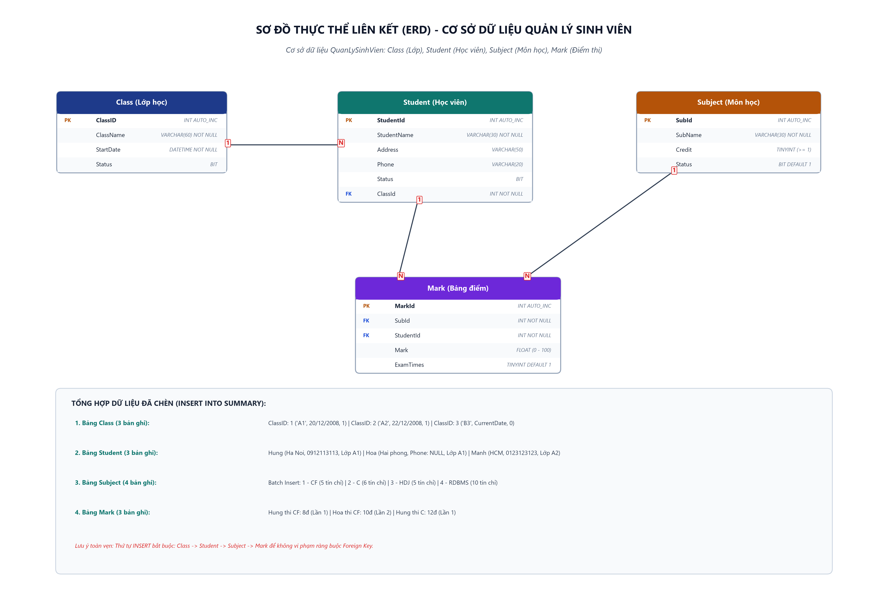

# [Thực hành] Thêm Dữ Liệu Vào Cơ Sở Dữ Liệu Quản Lý Sinh Viên

> **Khóa học**: Cơ sở dữ liệu & Hệ quản trị CSDL MySQL  
> **Học viên thực hiện**: Nguyễn Tuấn Đạt  
> **Kho lưu trữ (Repository)**: `https://github.com/proyctk03-eng/git-final-practice`  
> **Thư mục bài tập**: `sql-student-management-insert-data/`  
> **Nhánh tham khảo CodeGym**: `jwbd-2023-sql-student-management-insert-into (dev)`

---

## 1. Mục Tiêu Bài Thực Hành
- Thành thạo việc sử dụng câu lệnh `INSERT INTO` để thêm dữ liệu vào các bảng trong MySQL.
- Nắm vững các kỹ thuật chèn dữ liệu nâng cao:
  - Chèn theo thứ tự cột mặc định: `INSERT INTO table VALUES (...)`.
  - Chèn chỉ định danh sách cột để xử lý các trường mang giá trị `NULL` hoặc nhận giá trị mặc định (`DEFAULT`): `INSERT INTO table (col1, col2) VALUES (...)`.
  - Chèn hàng loạt nhiều bản ghi đồng thời trong một câu lệnh duy nhất (Batch / Bulk INSERT).
  - Sử dụng hàm thời gian hệ thống của MySQL: `CURRENT_DATE`.
- Hiểu rõ quy tắc thứ tự chèn dữ liệu (`Class` &rarr; `Student` &rarr; `Subject` &rarr; `Mark`) để bảo đảm toàn vẹn tham chiếu khóa ngoại (Foreign Key Integrity).

---

## 2. Sơ Đồ Thực Thể Liên Kết (ERD)



---

## 3. Cấu Trúc Bảng & Dữ Liệu Chèn Theo 5 Bước Hướng Dẫn

### Bước 1: Chọn cơ sở dữ liệu `QuanLySinhVien`
```sql
USE QuanLySinhVien;
```

---

### Bước 2: Thêm dữ liệu vào bảng `Class` (Lớp học)
- **Cấu trúc bảng**: `ClassID` (PK, Auto Increment), `ClassName` (VARCHAR(60)), `StartDate` (DATETIME), `Status` (BIT).
- **Dữ liệu chèn**:
  - Lớp `A1`: Khai giảng ngày 20/12/2008, trạng thái hoạt động (`1`).
  - Lớp `A2`: Khai giảng ngày 22/12/2008, trạng thái hoạt động (`1`).
  - Lớp `B3`: Khai giảng ngày hiện tại (`current_date`), trạng thái chưa mở (`0`).

```sql
INSERT INTO Class VALUES (1, 'A1', '2008-12-20', 1);
INSERT INTO Class VALUES (2, 'A2', '2008-12-22', 1);
INSERT INTO Class VALUES (3, 'B3', current_date, 0);
```

---

### Bước 3: Thêm dữ liệu vào bảng `Student` (Học viên)
- **Kỹ thuật quan trọng**: Với sinh viên **Hoa**, không có số điện thoại. Bằng cách liệt kê tường minh các cột `(StudentName, Address, Status, ClassId)` và bỏ qua cột `Phone`, MySQL sẽ tự động gán giá trị `NULL` cho trường `Phone`.

```sql
INSERT INTO Student (StudentName, Address, Phone, Status, ClassId) 
VALUES ('Hung', 'Ha Noi', '0912113113', 1, 1);

INSERT INTO Student (StudentName, Address, Status, ClassId) 
VALUES ('Hoa', 'Hai phong', 1, 1);

INSERT INTO Student (StudentName, Address, Phone, Status, ClassId) 
VALUES ('Manh', 'HCM', '0123123123', 0, 2);
```

---

### Bước 4: Thêm dữ liệu hàng loạt vào bảng `Subject` (Batch Insert)
- **Kỹ thuật tối ưu**: Thay vì thực hiện 4 câu lệnh `INSERT` đơn lẻ gây tốn chi phí kết nối và giao dịch (I/O Overhead), ta gom 4 bản ghi vào 1 câu lệnh duy nhất:

```sql
INSERT INTO Subject VALUES 
(1, 'CF', 5, 1),
(2, 'C', 6, 1),
(3, 'HDJ', 5, 1),
(4, 'RDBMS', 10, 1);
```

---

### Bước 5: Thêm dữ liệu vào bảng `Mark` (Bảng điểm)
- Bảng trung gian lưu vết điểm thi của từng sinh viên cho từng môn học qua khóa ngoại kép `SubId` và `StudentId`:

```sql
INSERT INTO Mark (SubId, StudentId, Mark, ExamTimes) 
VALUES 
(1, 1, 8, 1),
(1, 2, 10, 2),
(2, 1, 12, 1);
```

---

## 4. Bảng Dữ Liệu Thu Được & Truy Vấn Kiểm Tra

### 4.1. Bảng `Class`
| ClassID | ClassName | StartDate | Status |
|:---:|:---:|:---:|:---:|
| 1 | A1 | 2008-12-20 00:00:00 | 1 |
| 2 | A2 | 2008-12-22 00:00:00 | 1 |
| 3 | B3 | Ngày hiện tại (CURRENT_DATE) | 0 |

### 4.2. Bảng `Student`
| StudentId | StudentName | Address | Phone | Status | ClassId |
|:---:|---|---|:---:|:---:|:---:|
| 1 | Hung | Ha Noi | 0912113113 | 1 | 1 |
| 2 | Hoa | Hai phong | *NULL* | 1 | 1 |
| 3 | Manh | HCM | 0123123123 | 0 | 2 |

### 4.3. Bảng `Subject`
| SubId | SubName | Credit | Status |
|:---:|---|:---:|:---:|
| 1 | CF | 5 | 1 |
| 2 | C | 6 | 1 |
| 3 | HDJ | 5 | 1 |
| 4 | RDBMS | 10 | 1 |

### 4.4. Bảng `Mark`
| MarkId | SubId | StudentId | Mark | ExamTimes |
|:---:|:---:|:---:|:---:|:---:|
| 1 | 1 | 1 | 8 | 1 |
| 2 | 1 | 2 | 10 | 2 |
| 3 | 2 | 1 | 12 | 1 |

---

### 4.5. Truy vấn tổng hợp xác thực liên kết (Verification Query)
```sql
SELECT 
    s.StudentId,
    s.StudentName,
    c.ClassName,
    sub.SubName,
    m.Mark AS DiemThi,
    m.ExamTimes AS LanThi
FROM Mark m
JOIN Student s ON m.StudentId = s.StudentId
JOIN Subject sub ON m.SubId = sub.SubId
JOIN Class c ON s.ClassId = c.ClassID
ORDER BY s.StudentId, sub.SubName;
```

**Kết quả truy vấn:**
| StudentId | StudentName | ClassName | SubName | DiemThi | LanThi |
|:---:|---|:---:|:---:|:---:|:---:|
| 1 | Hung | A1 | C | 12 | 1 |
| 1 | Hung | A1 | CF | 8 | 1 |
| 2 | Hoa | A1 | CF | 10 | 2 |

---

## 5. Danh Mục File Dự Án
- `student_management_data.sql`: Kịch bản SQL hoàn chỉnh bao gồm DDL khởi tạo, DML chèn dữ liệu và truy vấn kiểm tra.
- `erd_quanly_sinhvien.png`: Ảnh sơ đồ ERD độ nét cao 300 DPI.
- `index.html`: Giao diện web trực quan tra cứu dữ liệu các bảng và kịch bản SQL.
- `generate_erd.py`: Script Python sinh ảnh sơ đồ ERD.
