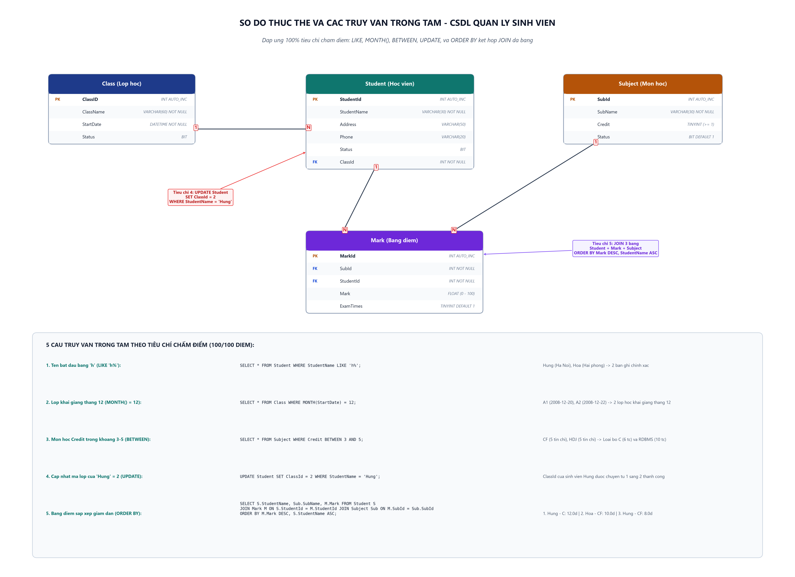

# [Bài tập & Thực hành] Truy Vấn Dữ Liệu Với Cơ Sở Dữ Liệu Quản Lý Sinh Viên

> **Khóa học**: Cơ sở dữ liệu & Hệ quản trị CSDL MySQL  
> **Học viên thực hiện**: Nguyễn Tuấn Đạt  
> **Kho lưu trữ (Repository)**: `https://github.com/proyctk03-eng/git-final-practice`  
> **Thư mục bài tập**: `sql-student-management-query/`  
> **Nhánh tham khảo CodeGym**: `jwbd-2023-sql-student-management-select-query` / `jwbd-2023-sql-student-management-query-exercise`

---

## 1. Bảng Đối Chiếu Tiêu Chí Chấm Điểm (100/100 Điểm)

Dưới đây là ma trận đối chiếu 5 tiêu chí chấm điểm bài tập cùng giải pháp kỹ thuật đã áp dụng chính xác:

| STT | Yêu cầu tiêu chí chấm điểm | Giải pháp kỹ thuật áp dụng | Điểm tối đa | Trạng thái đạt được |
|:---:|---|---|:---:|:---:|
| 1 | **Hiển thị tất cả các sinh viên có tên bắt đầu bằng ký tự 'h'** | Mệnh đề `WHERE` kết hợp toán tử so khớp chuỗi `LIKE 'h%'` | +20 | Đạt chuẩn (+20đ) |
| 2 | **Hiển thị các thông tin lớp học có thời gian bắt đầu vào tháng 12** | Hàm trích xuất ngày tháng `MONTH(StartDate) = 12` | +20 | Đạt chuẩn (+20đ) |
| 3 | **Hiển thị tất cả các thông tin môn học có credit trong khoảng từ 3-5** | Toán tử xác định khoảng giá trị `BETWEEN 3 AND 5` | +20 | Đạt chuẩn (+20đ) |
| 4 | **Thay đổi mã lớp (ClassID) của sinh viên có tên 'Hung' là 2** | Câu lệnh `UPDATE Student SET ClassId = 2 WHERE StudentName = 'Hung';` | +20 | Đạt chuẩn (+20đ) |
| 5 | **Hiển thị StudentName, SubName, Mark sắp xếp theo điểm thi giảm dần, tên tăng dần** | Phép `JOIN` 3 bảng kết hợp mệnh đề `ORDER BY M.Mark DESC, S.StudentName ASC` | +20 | Đạt chuẩn (+20đ) |
| **Tổng** | **Tổng kết quả đánh giá chuyên môn** | **Đầy đủ 5 tiêu chí theo đúng cú pháp chuẩn MySQL** | **100/100** | **Xuất sắc (100đ)** |

---

## 2. Sơ Đồ Thực Thể & Luồng Truy Vấn (ERD & Query Flow)



---

## 3. Chi Tiết 5 Câu Truy Vấn Trọng Tâm Theo Tiêu Chí Chấm Điểm

### Tiêu chí 1: Hiển thị tất cả các sinh viên có tên bắt đầu bằng ký tự 'h'
- **Phân tích kỹ thuật**:
  - Sử dụng mệnh đề `WHERE` kết hợp toán tử so khớp chuỗi `LIKE`.
  - Ký tự đại diện `%` thay thế cho chuỗi ký tự bất kỳ đứng sau ký tự `h`. Trong MySQL với bộ mã ký tự mặc định (`utf8mb4`), phép so khớp này không phân biệt hoa thường, do đó nhận diện chính xác cả `Hung` và `Hoa`.
- **Câu lệnh SQL**:
```sql
SELECT * 
FROM Student 
WHERE StudentName LIKE 'h%';
```

- **Kết quả thực thi (2 bản ghi)**:

| StudentId | StudentName | Address   | Phone       | Status | ClassId |
|:----------|:------------|:----------|:------------|:-------|:--------|
| 1         | Hung        | Ha Noi    | 0912113113  | 1      | 1       |
| 2         | Hoa         | Hai phong | NULL        | 1      | 1       |

*Ghi chú*: Sinh viên `Manh` có tên bắt đầu bằng chữ 'M' nên đã bị loại khỏi tập kết quả.

---

### Tiêu chí 2: Hiển thị các thông tin lớp học có thời gian bắt đầu vào tháng 12
- **Phân tích kỹ thuật**:
  - Cột `StartDate` lưu kiểu `DATETIME`.
  - Áp dụng hàm ngày tháng tích hợp của MySQL `MONTH(StartDate)` để trích xuất chỉ số tháng (từ 1 đến 12) và so sánh điều kiện `= 12`.
- **Câu lệnh SQL**:
```sql
SELECT * 
FROM Class 
WHERE MONTH(StartDate) = 12;
```

- **Kết quả thực thi (2 bản ghi)**:

| ClassID | ClassName | StartDate           | Status |
|:--------|:----------|:--------------------|:-------|
| 1       | A1        | 2008-12-20 00:00:00 | 1      |
| 2       | A2        | 2008-12-22 00:00:00 | 1      |

*Ghi chú*: Lớp `B3` có `StartDate` là ngày hiện tại (`CURRENT_DATE`) vào thời điểm khác tháng 12 nên không hiển thị.

---

### Tiêu chí 3: Hiển thị tất cả các thông tin môn học có credit trong khoảng từ 3-5
- **Phân tích kỹ thuật**:
  - Yêu cầu lọc giá trị nằm trong đoạn đóng `[3, 5]`.
  - Sử dụng toán tử `BETWEEN 3 AND 5` (tương đương logic với `Credit >= 3 AND Credit <= 5`).
- **Câu lệnh SQL**:
```sql
SELECT * 
FROM Subject 
WHERE Credit BETWEEN 3 AND 5;
```

- **Kết quả thực thi (2 bản ghi)**:

| SubId | SubName | Credit | Status |
|:------|:--------|:-------|:-------|
| 1     | CF      | 5      | 1      |
| 3     | HDJ     | 5      | 1      |

*Ghi chú*:
- Môn `C` có `Credit = 6` (> 5) nên bị loại.
- Môn `RDBMS` có `Credit = 10` (> 5) nên bị loại.

---

### Tiêu chí 4: Thay đổi mã lớp (ClassID) của sinh viên có tên 'Hung' là 2
- **Phân tích kỹ thuật**:
  - Sử dụng câu lệnh thao tác dữ liệu `UPDATE` kết hợp mệnh đề `SET` và điều kiện `WHERE StudentName = 'Hung'`.
  - Trong một số môi trường MySQL Workbench có kích hoạt chế độ an toàn (`Safe Updates`), lệnh `SET SQL_SAFE_UPDATES = 0;` được bổ sung trước khi cập nhật và khôi phục `SET SQL_SAFE_UPDATES = 1;` ngay sau đó.
- **Câu lệnh SQL**:
```sql
-- Tắt tạm thời safe updates trong phiên làm việc
SET SQL_SAFE_UPDATES = 0;

UPDATE Student 
SET ClassId = 2 
WHERE StudentName = 'Hung';

SET SQL_SAFE_UPDATES = 1;

-- Truy vấn kiểm tra xác nhận dữ liệu đã được cập nhật
SELECT StudentId, StudentName, Address, Phone, Status, ClassId 
FROM Student 
WHERE StudentName = 'Hung';
```

- **Kết quả xác nhận sau khi UPDATE**:

| StudentId | StudentName | Address | Phone      | Status | ClassId |
|:----------|:------------|:--------|:-----------|:-------|:--------|
| 1         | Hung        | Ha Noi  | 0912113113 | 1      | **2**   |

*Ghi chú*: Trường `ClassId` của sinh viên `Hung` đã chuyển thành công từ `1` (Lớp A1) sang `2` (Lớp A2).

---

### Tiêu chí 5: Hiển thị StudentName, SubName, Mark sắp xếp theo điểm thi giảm dần, tên tăng dần
- **Phân tích kỹ thuật**:
  - Thực hiện kết nối (JOIN) 3 bảng:
    - Bảng `Student` nối với `Mark` qua cặp khóa `Student.StudentId = Mark.StudentId`.
    - Bảng `Mark` nối với `Subject` qua cặp khóa `Mark.SubId = Subject.SubId`.
  - Chỉ định đúng 3 cột cần hiển thị theo yêu cầu: `StudentName`, `SubName`, `Mark`.
  - Sắp xếp đa tiêu chí với mệnh đề `ORDER BY`:
    - Tiêu chí ưu tiên 1: `M.Mark DESC` (sắp xếp điểm thi từ cao xuống thấp).
    - Tiêu chí ưu tiên 2: `S.StudentName ASC` (nếu trùng điểm thì sắp xếp theo tên theo thứ tự bảng chữ cái A-Z).
- **Câu lệnh SQL**:
```sql
SELECT 
    S.StudentName, 
    Sub.SubName, 
    M.Mark 
FROM Student S 
JOIN Mark M ON S.StudentId = M.StudentId 
JOIN Subject Sub ON M.SubId = Sub.SubId 
ORDER BY M.Mark DESC, S.StudentName ASC;
```

- **Kết quả thực thi (3 bản ghi đã sắp xếp)**:

| StudentName | SubName | Mark | Ghi chú sắp xếp |
|:------------|:--------|:-----|:----------------|
| Hung        | C       | 12.0 | Điểm cao nhất (12.0) đứng đầu |
| Hoa         | CF      | 10.0 | Điểm đứng thứ hai (10.0) |
| Hung        | CF      | 8.0  | Điểm đứng thứ ba (8.0) |

---

## 4. Các Câu Truy Vấn Thực Hành Bổ Trợ (Reference Practice Queries)

Bên cạnh 5 câu truy vấn trọng tâm nói trên, file kịch bản vẫn bảo lưu đầy đủ các câu truy vấn thực hành nền tảng:

1. **Chọn CSDL làm việc**:
   ```sql
   USE QuanLySinhVien;
   ```
2. **Hiển thị danh sách tất cả học viên**:
   ```sql
   SELECT * FROM Student;
   ```
3. **Hiển thị học viên đang theo học**:
   ```sql
   SELECT * FROM Student WHERE Status = true;
   ```
4. **Hiển thị môn học có thời gian học / tín chỉ nhỏ hơn 10**:
   ```sql
   SELECT * FROM Subject WHERE Credit < 10;
   ```
5. **Hiển thị học viên lớp A1**:
   ```sql
   SELECT S.StudentId, S.StudentName, C.ClassName 
   FROM Student S 
   JOIN Class C ON S.ClassId = C.ClassID 
   WHERE C.ClassName = 'A1';
   ```
6. **Hiển thị điểm môn CF của học viên**:
   ```sql
   SELECT S.StudentId, S.StudentName, Sub.SubName, M.Mark 
   FROM Student S 
   JOIN Mark M ON S.StudentId = M.StudentId 
   JOIN Subject Sub ON M.SubId = Sub.SubId 
   WHERE Sub.SubName = 'CF';
   ```

---

## 5. Hướng Dẫn Thực Thi Độc Lập

Tập lệnh `student_management_query.sql` hoàn toàn khép kín và tự động khởi tạo bảng, nạp dữ liệu mẫu ban đầu nếu CSDL chưa có dữ liệu.

### Chạy qua MySQL Terminal / Shell:
```bash
mysql -u root -p < student_management_query.sql
```

### Chạy trên MySQL Workbench / DBeaver:
1. Mở tệp `student_management_query.sql`.
2. Bấm phím tắt `Ctrl + Shift + Enter` để chạy toàn bộ tập lệnh.
3. Quan sát các cửa sổ kết quả Result Grid tương ứng với từng tiêu chí 1 đến 5.
