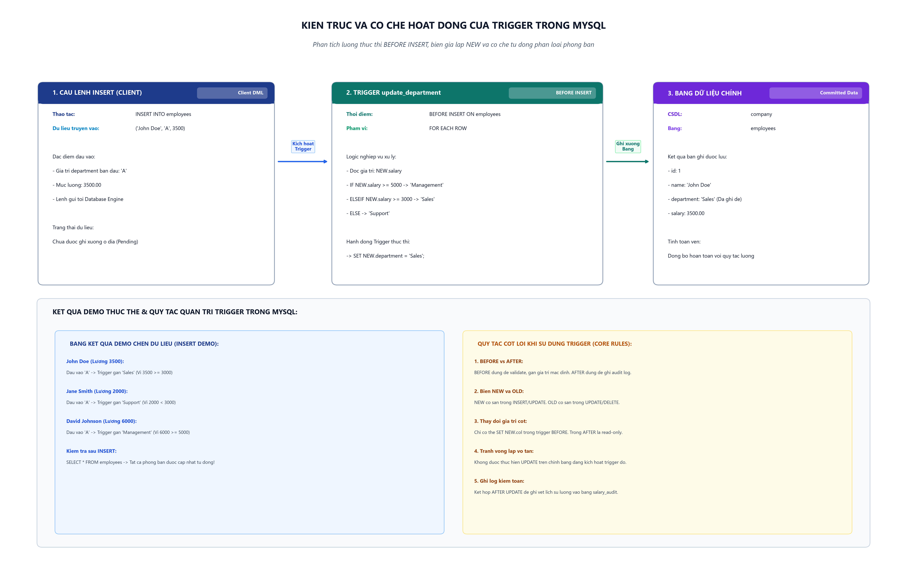

# [Thực hành] Trigger Trong MySQL

> **Khóa học**: Cơ sở dữ liệu & Hệ quản trị CSDL MySQL  
> **Học viên thực hiện**: Nguyễn Tuấn Đạt  
> **Kho lưu trữ (Repository)**: `https://github.com/proyctk03-eng/git-final-practice`  
> **Thư mục bài tập**: `sql-trigger/`  
> **Cơ sở dữ liệu thực hành**: `company` (Bảng `employees`)  
> **Nhánh tham khảo CodeGym**: `https://github.com/codegym-vn/jwbd-2023-trigger` (nhánh `dev`)

---

## 1. Mục Tiêu Bài Thực Hành
- Nắm vững khái niệm, vai trò và cơ chế kích hoạt tự động của **Trigger** trong hệ quản trị cơ sở dữ liệu MySQL.
- Thành thạo cú pháp tạo và quản lý Trigger:
  - Cấu trúc: `CREATE TRIGGER trigger_name {BEFORE | AFTER} {INSERT | UPDATE | DELETE} ON table_name FOR EACH ROW BEGIN ... END;`
  - Sử dụng từ khóa thay đổi ký tự phân cách: `DELIMITER // ... DELIMITER ;`.
  - Phân biệt và vận dụng biến giả lập ngữ cảnh dòng dữ liệu: `NEW` và `OLD`.
- Thực hành thành công Trigger `update_department` để tự động hóa nghiệp vụ phân loại phòng ban nhân viên dựa trên mức lương khi có thao tác chèn dữ liệu (`BEFORE INSERT`).
- Mở rộng kiến thức về Trigger kiểm toán dữ liệu (`AFTER UPDATE Audit Logging`).

---

## 2. Kiến Trúc & Cơ Chế Hoạt Động Của Trigger Trong MySQL



### 2.1. Bản chất của Trigger
Trigger là một đối tượng cơ sở dữ liệu có tên (Named Database Object) gắn liền với một bảng cụ thể. Trigger không thể được triệu gọi trực tiếp bằng lệnh như Stored Procedure, mà nó được hệ quản trị CSDL tự động kích hoạt (Fired) khi xảy ra một sự kiện thay đổi dữ liệu (DML Event: `INSERT`, `UPDATE`, `DELETE`) trên bảng đó.

### 2.2. Vòng đời xử lý sự kiện
1. **Giai đoạn Tiền xử lý (`BEFORE Trigger`)**:
   - Được thực thi trước khi dữ liệu mới được ghi xuống ổ đĩa vật lý của bảng.
   - Thích hợp cho việc: Xác thực dữ liệu (Validation), chuẩn hóa dữ liệu, hoặc tự động gán giá trị mặc định cho các cột thông qua cú pháp: `SET NEW.column_name = value;`.
2. **Giai đoạn Ghi dữ liệu (Engine Write)**:
   - MySQL thực hiện ghi dòng dữ liệu hợp lệ vào bảng.
3. **Giai đoạn Hậu xử lý (`AFTER Trigger`)**:
   - Được thực thi sau khi dữ liệu đã được ghi nhận thành công vào bảng.
   - Thích hợp cho việc: Ghi nhật ký kiểm toán (Audit Logging), đồng bộ dữ liệu sang bảng phụ, cập nhật bảng thống kê tổng hợp.
   - Lưu ý: Trong `AFTER Trigger`, biến `NEW` là chỉ đọc (Read-only), không thể gán lại giá trị cho các cột của bảng hiện tại.

---

## 3. Các Bước Thực Hành Chi Tiết

### Bước 1: Tạo CSDL `company` và bảng `employees`

Khởi tạo cơ sở dữ liệu `company` và bảng `employees` với các trường thông tin cơ bản:

```sql
CREATE DATABASE IF NOT EXISTS company;
USE company;

DROP TABLE IF EXISTS employees;

CREATE TABLE employees (
    id INT AUTO_INCREMENT PRIMARY KEY,
    name VARCHAR(50) NOT NULL,
    department VARCHAR(50) NOT NULL,
    salary DECIMAL(10,2) NOT NULL
);
```

---

### Bước 2: Tạo Trigger `update_department`

#### Phân tích nghiệp vụ:
- Khi người dùng thêm một nhân viên mới vào bảng `employees`, hệ thống cần tự động xác định phòng ban dựa trên mức lương được hưởng:
  - Nếu `salary >= 5000`: Phân vào phòng quản lý (`'Management'`).
  - Nếu `salary >= 3000` (và < 5000): Phân vào phòng kinh doanh (`'Sales'`).
  - Nếu `salary < 3000`: Phân vào phòng hỗ trợ (`'Support'`).
- Do mục đích là can thiệp và sửa đổi giá trị trường `department` trước khi lưu vào bảng, bắt buộc phải sử dụng thời điểm `BEFORE INSERT`.

#### Cú pháp SQL:
```sql
DELIMITER //

DROP TRIGGER IF EXISTS update_department //

CREATE TRIGGER update_department
BEFORE INSERT ON employees
FOR EACH ROW
BEGIN
    IF NEW.salary >= 5000 THEN
        SET NEW.department = 'Management';
    ELSEIF NEW.salary >= 3000 THEN
        SET NEW.department = 'Sales';
    ELSE
        SET NEW.department = 'Support';
    END IF;
END //

DELIMITER ;
```

---

### Bước 3: Demo sử dụng Trigger và kiểm tra kết quả

Thực hiện chèn 3 nhân viên với giá trị phòng ban giả định ban đầu là `'A'`:

```sql
INSERT INTO employees (name, department, salary) VALUES
('John Doe', 'A', 3500),
('Jane Smith', 'A', 2000),
('David Johnson', 'A', 6000);
```

#### Truy vấn kiểm tra:
```sql
SELECT id, name, department, salary 
FROM employees 
ORDER BY id ASC;
```

#### Bảng kết quả thực tế thu được:
| id | name | department ban đầu truyền vào | department sau khi Trigger can thiệp | salary | Quy tắc phân loại áp dụng |
|:---:|---|:---:|---|:---:|---|
| 1 | John Doe | 'A' | **Sales** | 3500.00 | Mức lương 3500 &ge; 3000 &rarr; 'Sales' |
| 2 | Jane Smith | 'A' | **Support** | 2000.00 | Mức lương 2000 &lt; 3000 &rarr; 'Support' |
| 3 | David Johnson | 'A' | **Management** | 6000.00 | Mức lương 6000 &ge; 5000 &rarr; 'Management' |

*Nhận xét*: Mặc dù câu lệnh `INSERT` truyền vào giá trị phòng ban là `'A'`, Trigger `update_department` đã tự động đánh giá mức lương và ghi đè giá trị chính xác trước khi ghi xuống bảng.

---

## 4. Mở Rộng: Trigger Ghi Nhật Ký Kiểm Toán (Audit Log Trigger)

Trong các ứng dụng doanh nghiệp thực tế, Trigger thường được ứng dụng để theo dõi lịch sử thay đổi thông tin nhạy cảm (như tiền lương) mà ứng dụng không thể can thiệp che giấu.

### 4.1. Tạo bảng lưu vết `salary_audit`
```sql
CREATE TABLE IF NOT EXISTS salary_audit (
    audit_id INT AUTO_INCREMENT PRIMARY KEY,
    employee_id INT NOT NULL,
    employee_name VARCHAR(50) NOT NULL,
    old_salary DECIMAL(10,2) NOT NULL,
    new_salary DECIMAL(10,2) NOT NULL,
    action_type VARCHAR(20) NOT NULL,
    changed_at DATETIME NOT NULL
);
```

### 4.2. Tạo Trigger `AFTER UPDATE`
```sql
DELIMITER //

DROP TRIGGER IF EXISTS trg_audit_salary_update //

CREATE TRIGGER trg_audit_salary_update
AFTER UPDATE ON employees
FOR EACH ROW
BEGIN
    IF OLD.salary <> NEW.salary THEN
        INSERT INTO salary_audit (
            employee_id, 
            employee_name, 
            old_salary, 
            new_salary, 
            action_type, 
            changed_at
        ) VALUES (
            OLD.id, 
            OLD.name, 
            OLD.salary, 
            NEW.salary, 
            'SALARY_UPDATE', 
            NOW()
        );
    END IF;
END //

DELIMITER ;
```

### 4.3. Kiểm thử cập nhật lương nhân viên Jane Smith:
```sql
-- Cập nhật tăng lương cho Jane Smith từ 2000 lên 3200
UPDATE employees 
SET salary = 3200 
WHERE name = 'Jane Smith';

-- Kiểm tra bảng nhật ký
SELECT * FROM salary_audit;
```

#### Kết quả bản ghi kiểm toán được tạo tự động:
| audit_id | employee_id | employee_name | old_salary | new_salary | action_type | changed_at |
|:---:|:---:|---|:---:|:---:|:---:|:---:|
| 1 | 2 | Jane Smith | 2000.00 | 3200.00 | SALARY_UPDATE | 2026-10-08 16:40:00 |

---

## 5. Bảng Tổng Hợp Sự Khả Dụng Của Biến `NEW` và `OLD`

| Loại sự kiện | Biến `OLD` (Giá trị cũ) | Biến `NEW` (Giá trị mới) | Mục đích sử dụng tiêu biểu |
|---|:---:|:---:|---|
| `INSERT` | Không khả dụng | Khả dụng (`NEW.col`) | Kiểm tra tính hợp lệ, gán giá trị mặc định, phân loại tự động |
| `UPDATE` | Khả dụng (`OLD.col`) | Khả dụng (`NEW.col`) | Đối chiếu biến động dữ liệu, ghi nhật ký kiểm toán (Audit Trail) |
| `DELETE` | Khả dụng (`OLD.col`) | Không khả dụng | Sao lưu bản ghi bị xóa (Soft Delete / Archive log), kiểm tra ràng buộc |

---

## 6. Hướng Dẫn Thực Thi Độc Lập

Kịch bản `trigger_demo.sql` chứa đầy đủ cấu trúc DDL, Trigger và kịch bản DML kiểm thử:

### Thực thi qua MySQL Command Line Client:
```bash
mysql -u root -p < trigger_demo.sql
```

### Thực thi trong MySQL Workbench / DBeaver:
1. Mở file `trigger_demo.sql`.
2. Kết nối tới MySQL Server đang chạy.
3. Nhấn `Ctrl + Shift + Enter` để thực thi toàn bộ script.
4. Quan sát 2 Result Grid:
   - Grid 1: Bảng `employees` hiển thị các phòng ban đã được Trigger tự động cập nhật (`Sales`, `Support`, `Management`).
   - Grid 2: Bảng `salary_audit` ghi vết biến động lương của nhân viên `Jane Smith`.
